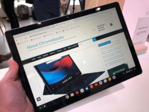
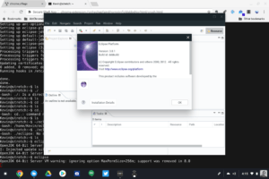

Last week, I suggested that [if you're considering the purchase of a Google Pixel Slate, there are two questions](https://www.aboutchromebooks.com/opinion/google-pixel-slate-vs-chromebook-should-i-buy-chromeos-tablet/) you should ask yourself. The answers should determine if the Pixel Slate is a potentially good device choice, based on your usage patterns and your mobility requirements. This week, I'm turning my attention to step two: Assuming the Pixel Slate will fit your needs, which of the five configurations should you buy?

Yes, I did say that you have **_five_** choices, even though there are only [four different processor choices](https://www.aboutchromebooks.com/news/pixel-slate-nocturne-intel-configurations-celeron-m3-i5-i7/). Note that the Pixel Slate configurations have two options if you go the Intel Celeron route. That chip paired with 4GB of memory and 32GB of storage costs $599 while you can double both the RAM and storage capacity with the $699 model, even though that price doesn't appear in the options.

## Just the basics please: $599 or $699

Is there a market for Celeron options? I'd say yes but those are going to be a tough sell. Why? Because this is entry level performance for the most part and you can get entry-level performance for under $300. Put another way: You really want the tablet form factor if you're going to spend $600 for a Pixel Slate without a keyboard.

If that sounds like you this might be a good option, provided you're not the kind of person that keeps more than a dozen Chrome tabs open at a time. And you're not big into running Android apps yet on a Chrome OS device.

Sure, the Pixel Slate with a Celeron will handle most Android apps just fine. However, I find that once you start using Android apps on a regular basis, it's easy to start installing more and more of them.

In either case, I'd strongly consider spending the extra $100 for the Celeron-powered Pixel Slate with 8GB of RAM and 64GB of storage. You can't add these later so this configuration will provide headroom to support more simultaneously open tabs or Android apps, plus the extra storage to hold those Android apps.

## I'm a power user on a budget: $799

<iframe style="width: 120px; height: 240px;" src="//ws-na.amazon-adsystem.com/widgets/q?ServiceVersion=20070822&amp;OneJS=1&amp;Operation=GetAdHtml&amp;MarketPlace=US&amp;source=ac&amp;ref=tf_til&amp;ad_type=product_link&amp;tracking_id=aboutchromebo-20&amp;marketplace=amazon&amp;region=US&amp;placement=B07D6FN5RJ&amp;asins=B07D6FN5RJ&amp;linkId=1ce640804b9c00b5bb50c6a6be51d391&amp;show_border=true&amp;link_opens_in_new_window=true&amp;price_color=333333&amp;title_color=0066c0&amp;bg_color=ffffff" frameborder="0" marginwidth="0" marginheight="0" scrolling="no" align="right"> </iframe>

With the Intel Core m3, you might be surprised to see me discuss it and the phrase "power user" together. But hear me out. For two weeks, I switched from the base $999 Pixelbook to a $599 HP Chromebook X2. The Pixelbook has a 7th-gen Intel Core i5 processor and 8GB of memory while the X2 had a 7th-gen Core m3 and 4GB of memory. Nearly every activity I did on the X2 performed just as well as it did on the Pixelbook. Even benchmark tests -- just a general indicator of performance, of course -- were extremely similar.

As a result, I think there's a solid chance that the $799 Pixel Slate configuration will be a top seller amongst the choices. I expect it to provide surprisingly good performance for most people. Someone who has used Chromebooks for some time and often keeps 20 open tabs on their device should be happy at this price point.

Are you often running Android apps instead of their web counterparts during the day? This should work fine as well. And, if you're curious about or want to dabble with Linux, you should be able to do that as well with this model. Most Android games should be fine at this price point too. although if you favor more graphically intensive titles, the next model up has a slightly better-integrated graphics package. _Update:_ The m3, i5 and i7 for the Pixel Slate actually all have the same Intel UHD Graphics 615 capabilities, so upgrading from an m3 won't gain any better graphics performance.

I probably wouldn't buy this model if you're going to [run Linux apps](https://www.aboutchromebooks.com/qa/project-crostini-chromebook-linux-apps-install-list/) all day side-by-side with Chrome OS, however. You likely can do that with the Core m3 but I think you'll push against hardware performance limits from time to time; the slightly higher performing Core i5 might be a good hedge against that. And you might need more local storage which also comes with that model.

## I love Linux and/or I'm a developer: $999 or $1599

I'm lumping in the last two configurations together because the use cases that fit these are only marginally different. The $999 and $1,599 options aren't needed for most mainstream Chrome OS users. Instead, I think they're geared more towards those who want to take full advantage of Linux containers and for those who are app developers.

For casual devs like myself -- I'm currently enrolled in a Software Engineering Certificate program at my local community college -- the $999 option ought to do. I'm not currently writing applications with a massive code base, for example. I have some [Python scripts that work with some of my IoT devices](https://staceyoniot.com/how-to-create-ambient-notifications-with-python-and-a-smart-bulb/) and I'm going through Java basics. I can turn the latter into Android apps in the future.

Android Studio and other IDEs run well enough for my meager development needs on the current Pixelbook. It has the same internal configuration as the Core i5 Pixel Slate with one difference: The Pixel Slate has a next-generation processor, so I expect a small performance bump.

Developers that create code for a living might be able to get by with the $999 Pixel Slate, but of course, will also have to consider the $1,599 option. That will provide more of a "no compromise" development machine that should handle most, if not all, situations. It's overkill for me, but I know plenty of coders who go all out and crave the best performance possible.

## Don't forget the extras!

Obviously, the Pixel Slate price is simply that: The cost of the Pixel Slate. Most people will want a keyboard unless they plan to use the device more for web content consumption, Android apps and light typing, so factor in another [$159 for the](https://www.brydge.com/pages/gtype-keyboard-for-google-pixel-slate) Brydge G-Type or $199 for the Google Pixel Slate Keyboard.

\[caption id="attachment\_1911" align="aligncenter" width="4032"\] Google Pixel Slate with Brydge G-Type keyboard\[/caption\]

Having briefly used both, I don't think you can go wrong with either choice. I'm leaning towards the Google option personally as I'd rather take advantage of the Pixel Slate's pogo pins over the Bluetooth connection of the Brydge choice. But again: Both seemed solid for typing and swiping on the trackpad during a brief hands on.

\[embed\]https://youtu.be/MqRuNDGV9lA\[/embed\]

There's also the $99 pen for the Pixel Slate. If you need it, you need it: I can't make that choice for you. I can tell you, however, that the original Pixelbook pen does work with the Pixel Slate. So if you're trading up from a Pixelbook to the Pixel Slate, keep your pen!

_**Updated on November 13:** Correction to reflect that the Core m3, i5, i7 models all have the same GPU capabilities._
