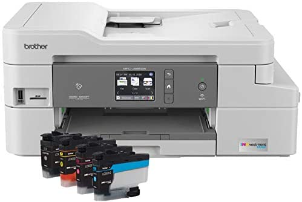
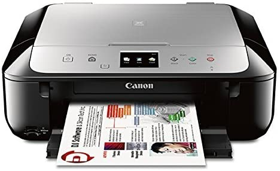
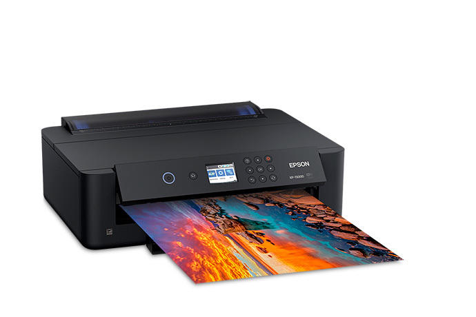
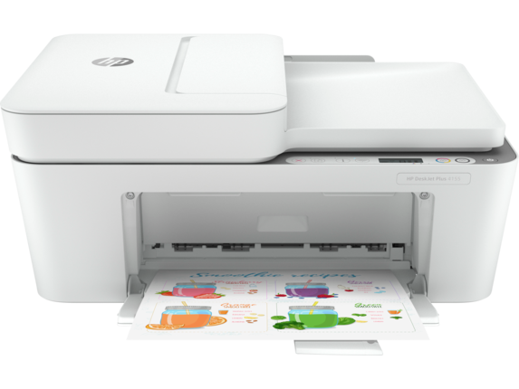
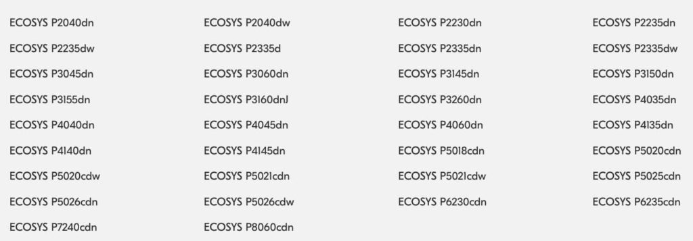

Ever since Google announced and then implemented the [deprecation of Cloud Print](https://www.aboutchromebooks.com/news/chrome-os-87-stable-channel-arrives-on-chromebooks-what-you-need-to-know/ "Chrome OS 87 Stable Channel arrives on Chromebooks: What you need to know") at the end of 2020, I've received many questions about printers and Chromebooks. To be honest, most recent printers from the last few years will work. Google has steadily improved printer compatibility with Chrome OS by using industry-standard methods. Even so, I thought it might be a good resource to have indicating which printers work with Chromebooks.

There are currently around 60 Brother printers that are compatible with Chromebooks. A full list of them is [here on Brother's site](https://support.brother.com/g/b/oscontents.aspx?c=us&lang=en&ossid=2). You'll find a range of Brother options including inkjets and laser printers that support both color and monochrome output. There are even a few fax machine printers on the list if you're old school.

Canon printer fans have many more choices, but all are inkjets. Currently, the list includes the following Canon printer series' but [check this link](https://ij.manual.canon/ij/webmanual/WebPortal/PTA/pta_app_models.html?lng=en&type=non&app=chromeos "https://ij.manual.canon/ij/webmanual/WebPortal/PTA/pta_app_models.html?lng=en&type=non&app=chromeos") to see if there are any updates prior to making a purchase:

XK90 series, XK80 series, XK70 series, XK60 series, XK50 series, TS9500 series, TS9100 series, TS9000 series, TS8430 series, TS8330 series, TS8300 series, TS8230 series, TS8200 series, TS8130 series, TS8100 series, TS8000 series, TS7430 series, TS7400 series, TS7330 series, TS700 series, TS6400 series, TS6330 series, TS6300 series, TS6230 series, TS6200 series, TS6130 series, TS6100 series, TS6000 series, TS5300 series, TS5100 series, TS5000 series, TS3400 series, TS3300 series, TS3100 series, TS300 series, TR9530 series, TR8630 series, TR8600 series, TR8530 series, TR8500 series, TR7600 series, TR7530 series, TR7500 series, TR7000 series, TR703 series, TR4500 series, TR150 series, MG7700 series, MG7500 series, MG7100 series, MG6900 series, MG6800 series, MG6600 series, MG5700 series, MG5600 series, MG3600 series, MB5400 series, MB5100 series, MB2700 series, MB2100 series, E4200 series, E3400 series, E3300 series, E3100 series, E300 series, GX7000 series, GX6000 series, G7000 series, G6000 series, G600 series, G5000 series, G500 series, G4010 series, G4000 series, G3060 series, G3020 series, G3010 series, G2060 series, G2020 series, G1020 series, iP110 series, iB4100 series, PRO-G1 series, PRO-S1 series, PRO-500 series, PRO-300 series, PRO-200 series, PRO-1000 series

If you have or are in the market for an Epson printer, there are easily over 100 models that work with Chromebooks[. The range includes Epson Printers And All-In-Ones For Home, Photo Printers for Home, Printers,](https://epson.com/Mobile-Printing-and-Scanning-Solutions/Printing-and-Scanning-Solutions/Chromebook-Printing/p/CHROMEBOOKPRINT#worksWithAccessories "https://epson.com/Mobile-Printing-and-Scanning-Solutions/Printing-and-Scanning-Solutions/Chromebook-Printing/p/CHROMEBOOKPRINT#worksWithAccessories") and all-in-ones for Work, just to name a few. Rather than break them all out, [check or bookmark this list if you prefer Epson](https://epson.com/Mobile-Printing-and-Scanning-Solutions/Printing-and-Scanning-Solutions/Chromebook-Printing/p/CHROMEBOOKPRINT#worksWithAccessories "https://epson.com/Mobile-Printing-and-Scanning-Solutions/Printing-and-Scanning-Solutions/Chromebook-Printing/p/CHROMEBOOKPRINT#worksWithAccessories").

HP is a popular printer brand but the company doesn't break out Chromebook compatibility by model. Instead, HP says that if their printer supports IPP Everywhere, it will work with a Chromebook.

[This page lists all IPP Everywhere printers](https://pwg.org/printers/index.html), currently showing 647 printers from various manufacturers including HP. If you're not familiar with IPP, it's the Internet Printing Protocol standard.

[Lexmark has its own list of about 130 printers that work with Chromebooks that you can find here](https://www.lexmark.com/en_us/solutions/print-solutions/mobile-print-solutions/chrome-enterprise-print-device-support.html "https://www.lexmark.com/en_us/solutions/print-solutions/mobile-print-solutions/chrome-enterprise-print-device-support.html"). I also saw dozens of Lexmark models on the IPP Everywhere page although there's sure to be some overlap.

[Ricoh's list](https://www.ricoh.com/support/chromeos#modellist) is equally as extensive as Lexmark's and the company also provides information about Chrome OS version support and details about the print software. Ricoh provides Google with drivers and other files that work with CUPS, or the Common Unix Printing System, that Chrome OS supports. Note that Ricoh skews more towards enterprise and small business offerings.

Looking at printers from Kyocera? No problem, [these work with Chromebooks](https://www.kyoceradocumentsolutions.com/support/chrome_os/index.html) according to the company:

While printing from a Chromebook used to be a hassle, and likely still is on printers that have seen better days, it's now much improved. You can typically print either over your wireless network or through a USB cable. The key is to have a supported printer and the list of those is growing every year.
