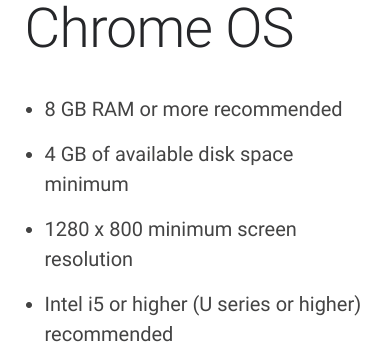
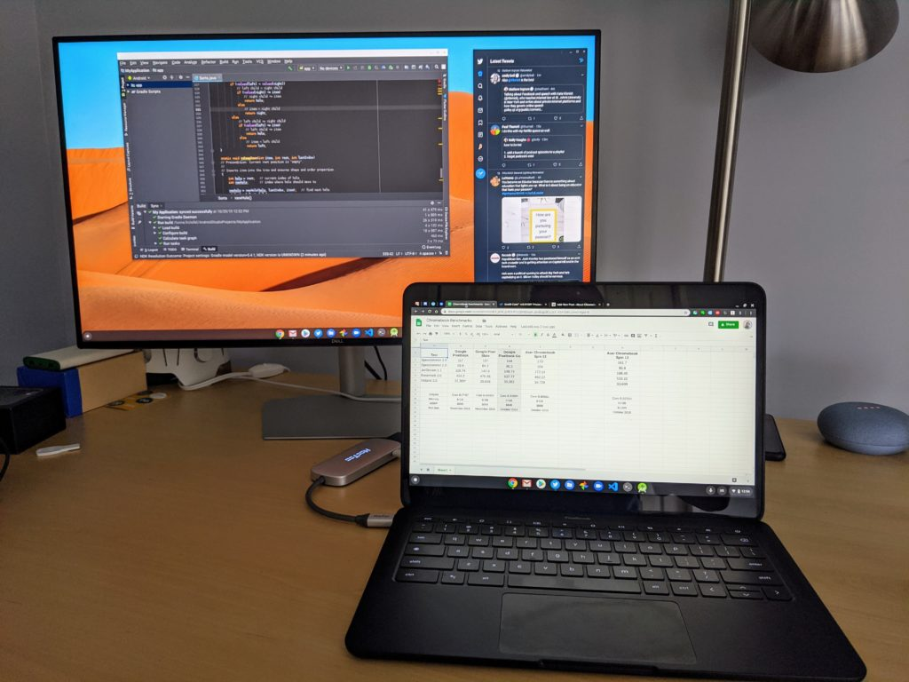

When the Pixelbook Go specs and images leaked in September, I shared some preliminary thoughts. Specifically, I wondered just [who the Google Pixelbook Go is for](https://www.aboutchromebooks.com/news/pixelbook-go-leaks-specifications-pricing-atlas/), considering potentially better options priced both above and below the anticipated price.

After two weeks of using the Pixelbook Go - [see my detailed review after spending 80+ hours using it here](https://www.aboutchromebooks.com/news/pixelbook-go-review-a-premium-price-validated-by-a-premium-device/) - I know who this premium built, Made by Google Chromebook is and isn't for.

First, though, let's look back at musing back in September when I wrote:

> ...the high-end Chromebook landscape has changed over the past 12 or so months.
> 
> There are very high-end, powerful options available in the aforementioned Acer Chromebook Spin 13, the Dell Inspiron Chromebook 14 and Lenovo’s Yoga Chromebook C630, which was the first Chromebook to offer a 4K display.  
>   
> All of these options, which have been available since last year, have U-Series processors, above-average to very good displays, and a reasonable choice of memory and storage options. Oh, and they cost between $599 and $999 before any sale discounts, which happen frequently.

With that thought process combined with the expected specifications and price, I immediately ruled out some target audiences.

## Most developers should pass on the Pixelbook Go

Full-time back-end developers interested in the Pixelbook Go, regardless of the model (including the forthcoming $1,399 option with 4K display and 16 GB of memory), should really pass.

For starters, the 8 GB of memory in both the $649 and $849 won't make your local IDE of choice too happy but that's not the biggest challenge. For developing in Android Studio, for example, [Google recommends something more potent than the mobile-centric Y-Series processors](https://developer.android.com/studio/) powering the Pixelbook Go.

So even bumping up to either the $999 or $1,399 Pixelbook Go, to get 16 GB of memory, a Core i7 or a 4K display isn't likely going to help you much. The only caveat I have would be if you develop in the cloud or remotely access a development server, in which case, you'd be fine. However, you can follow those approaches with just about any laptop.

Web developers might have an easier time working with the Pixelbook Go though. A solid text or code editor like [Sublime Text](https://www.sublimetext.com/) or [Atom](https://atom.io/) runs excellent on my $849 review model, for example, and the Developer Tools built into Chrome & Chrome OS are quite good.

And for Computer Science students using a light IDE for small homework projects ought to be fine too. I should know: I've used [a Pixel Slate with basically the same internals as the Pixelbook Go for my Java classes](https://www.aboutchromebooks.com/news/how-to-code-on-a-chromebook-crostini-pixel-slate/). More recently, I've used it [with an Arduino board to get my feet wet with Assembly language](https://www.aboutchromebooks.com/news/how-to-code-an-arduino-with-a-chromebook/).

## College students should definitely Go take a look at this Chromebook

Depending on their major, university technology requirements and budget, I think the $649 Pixelbook Go is well worth the look for most college students.

There's a definite MacBook-like look to the Pixelbook Go and I see those Apple laptops everywhere on my campus as well as at my daughter's college. In fact, she bought the latest MacBook Pro before this semester, spending $1,299 for it. (Editor's note: I paid for it.)

For her studies, the Pixelbook Go would meet all of her needs because even though some of her papers must be handed in as a Microsoft Word file, her assignments only require minimal, basic formatting. She could (and often does) write in Google Docs, then save in Microsoft's .docx format. So why no Pixelbook Go for her? Her side job is as a photographer and she routinely edits RAW photos for hours at a time. The MacBook Pro is a much better choice in that case.

So students should consider if Chrome OS will meet their study needs. Even if there's one or two small things that can't be done on a Chromebook, the Pixelbook Go could be an option if those few tasks can be conveniently managed in the campus' computer lab. For my current database class, we use Microsoft SQL Server and we have to use a Windows machine to connect to our databases. I simply hit the lab whenever I'm on campus and need to do that; otherwise, I'm on a Chromebook.

## Budget Chromebook buyers have better options for less

As I said in my review, the Pixelbook Go isn't a budget Chromebook; it's a budget Pixelbook. Starting at $649, it's not likely the right choice for someone who has just a few hundred dollars to spend or simply doesn't want to invest more than that.

I liken this market segment and use-case as part-time computer usage, such as our "coffee table laptop". You want or need something inexpensive but works when you feel the need to search the web, check social media networks or hit up email. And for $200 to $300, there are dozens of options that meet those requirements.

These often have a plastic chassis, displays that aren't as bright or as high-resolution as the Pixelbook Go, and you certainly won't be looking at an Intel Core processor or 8 GB of memory.

Instead, you'll have either a Celeron or Pentium processor, perhaps a 720p display, no backlit keyboard or other nice-to-haves. But that's OK. Again, this use case isn't for a full-time device, so why spend $649 or more?

## Everyday users who want a premium Pixelbook for less

## 

That leaves a fairly large audience of current Chrome OS users who really want "the Pixelbook experience" without the $999 Pixelbook price. This is the sweet spot for the Pixelbook Go, although you can occasionally find refurbished Pixelbooks or discounted models from time to time.

These are the folks that know that a Chromebook meets enough of their needs to use the device for 80-, 90- or even 100-percent of the time. Sure, a great Chromebook can be had for $400 to $600 but that fanless $649 Core m3 Pixelbook Go is likely lighter, sturdier and will run longer on a charge.

This market segment will also appreciate the outstanding, quiet keyboard experience, the ability to gain two-hours of run-time with a 20-minute charge and the second-best speakers I've heard on a Chromebook; I still think the Pixel Slate's front-facing output sounds a smidge better.

If you're in this category, you're getting a much better all-around device and experience than any budget Chromebook. For the same money, you could get Chrome OS laptop with a more powerful processor but you're giving up the fanless aspect, which also makes the competing device thicker and heavier. After toting the thin, 2.3-pound Pixelbook Go around campus and my travels, I've come to appreciate the design.

Again, this is a budget Pixelbook. At the base level - good enough for most potential buyers who aren't power users or developers - it's $350 cheaper than the original Pixelbook with a newer but slightly slower processor. Even if you consider a like-for-like model comparison the $849 Pixelbook Go is $150 less for the older model.

As long as you don't mind giving up the 2-in-1 form factor and pen support of the Pixelbook, the less expensive Pixelbook Go won't disappoint.
