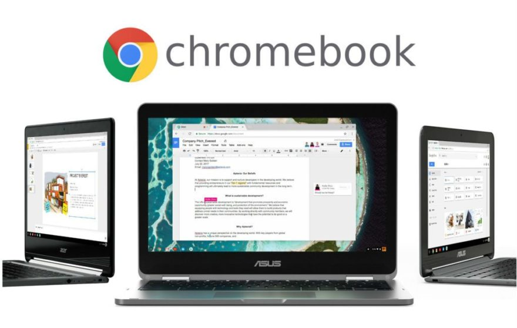
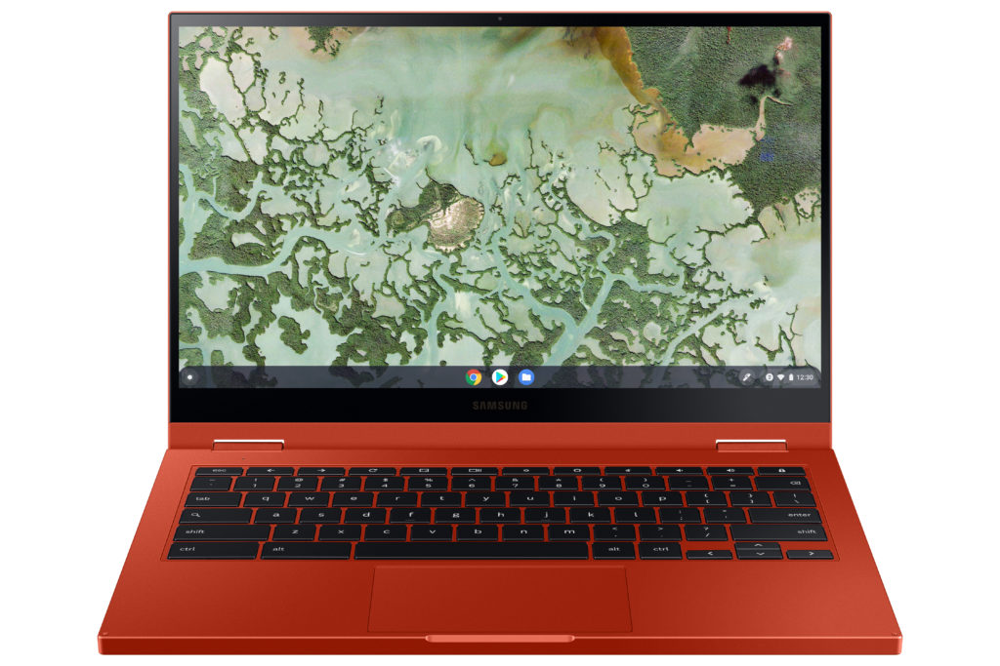
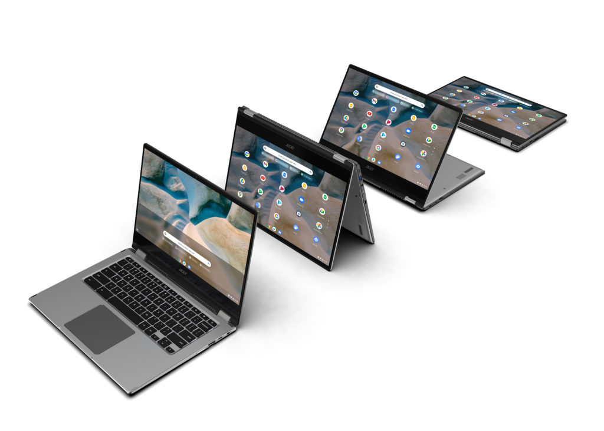

I hope I'm wrong when I say this, but I suspect Chromebooks won't get much of the spotlight at the Consumer Electronics Show this year. It's not as if a typical CES normally has everyone talking about Chromebooks, of course.

They're a small niche product in the wider world of general computing, connected devices, home entertainment products, and other CES stars. But this year may be even less of an "event" for us Chromebook fans.

Much of the reason I think this is because of 2020.

The COVID-19 pandemic negatively impacted so many things and the most relevant one here is the supply and production of both chipsets and devices that use them. Just months ago it was [near impossible to find any Chromebook inventory, at a time where many students needed them for remote learning](https://www.aboutchromebooks.com/news/school-chromebooks-sold-out-alternative-options-cloudready-raspberry-pi/).

Chromebooks availability is a little better but most of what I'm seeing are still [older devices that aren't, in my opinion, worth it](https://www.aboutchromebooks.com/opinion/opinion-amazon-needs-to-stop-listing-chromebooks-with-misleading-information/). Still, there are some relatively new Chromebooks on store shelves so inventory has started to catch up.

Aside from the supply issues, the pandemic also negatively impacted workplaces. Not just yours, mine and our neighbors, but the companies that design and make Chromebooks too. I've spoken to several people at Google in the past six months that have told me productivity has been hit to a degree. That should be no surprise, even in a world where we can and do work remotely. Even in the workplace, people are worried about that family member or close who tested positive for COVID-19 or is out of work because of it.

And then we have the first two Chromebook announcements at CES 2021, taking place even before the show officially began.

The [Samsung Galaxy Chromebook 2 launched in two configurations](https://www.aboutchromebooks.com/news/ces-2021-samsung-galaxy-chromebook-2-price-release-date-specifications/) that honestly could have launched last year alongside the original Galaxy Chromebook. That $999 device arrived with the 4K OLED display, fast NVMe storage, and 10th-gen Intel Core i5.

Samsung Galaxy Chromebook 2

This year you can get basically the same chassis minus an included stylus and fingerprint sensor, slower storage, less memory and a 10th-gen Intel Celeron for $549. Or you can bump to a 10th-gen Intel Core i3 with more storage and memory for $699. I wouldn't call that worthy of a 2021 launch when it could have arrived at CES 2020.

Acer debuted its first AMD Ryzen Chromebook line with the [Acer Chromebook Spin 514 that starts at $449](https://www.aboutchromebooks.com/news/ces-2021-acer-chromebook-spin-514-amd-ryzen-price-specifications-release-date/).

Acer Chromebook Spin 514

It's great to see AMD under the hood of more Chromebooks but keep in mind that these aren't the Ryzen processors that are beating Intel's latest chips. Those are based on AMD's Zen 2 architecture with a more compact 7 to 12-nanometer process. The AMD Ryzen 3000C chipsets are still the older Zen or Zen+ architecture built on a 12 to 14-nanometer process. So while a step in the right direction, it's more of a baby step this time.

Don't forget that Acer already announced some details of its ARM-powered Chromebook back in October. The [Acer Chromebook Spin 513 powered by Qualcomm's Snapdragon 7c will start at $399](https://www.aboutchromebooks.com/news/hello-acer-chromebook-spin-513-the-first-with-a-qualcomm-snapdragon-7c/) when it arrives later this quarter. Perhaps we get more details on it during CES 2021?

Acer Chromebook Spin 513

Other than those details, I don't expect to hear more on the Chromebook front from Acer, nor from Samsung. It's possible one or the other has held something back but I'm dubious.

That leaves the other folks from Asus, Dell, HP, and Lenovo to bring some new innovation to Chromebooks at CES 2021.

I'm ruling out Dell right away though. They're not the kind of company that offers a wide range of Chromebooks.

Asus typically has [a flagship Chromebook](https://www.aboutchromebooks.com/news/asus-chromebook-flip-c436-specifications-release-date-price-ces-2020/) and a few lower-priced offerings to announce, so there's hope there. It wasn't long ago that [HP introduced the HP Chromebook 11b](https://www.aboutchromebooks.com/news/hp-chromebook-11a-vs-lenovo-duet-chromebook/) with the same MediaTek processor that powers the Lenovo Chromebook Duet. Maybe there's something new in the low- to mid-range market for HP but the company seems to keep revising the X360 models more than creating brand new Chromebook experiences. Hopefully, we hear something from the company this week.

Lenovo Chromebook Duet

Lenovo is my wild-card best choice here for something interesting. Last year it launched the [Chromebook Duet, which I chose as Chromebook of the year for 2020](https://www.aboutchromebooks.com/news/my-pick-for-2020-chromebook-of-the-year/). But it also debuted the value-conscious [Lenovo Chromebook Flex 5](https://www.aboutchromebooks.com/news/did-you-miss-the-new-lenovo-chromebook-flex-5-at-ces-2020/) catching many by surprise. Save for the repeated comments I hear about the plastic hinges breaking, it's a solid, affordable workhorse.

Wrapping up, I'm going to suggest what happens if I'm wrong here. In that case, I anticipate hearing about slightly tweaked models that use Intel's 11th-gen processors. There's nothing wrong with that. But, given how supply chains are really just now or have recently recovered, I'd expect most of those new Intel processors to be found first in Windows PCs, not Chromebooks. That means we might not see such upgraded devices until the second quarter in a device or two, with more to follow in the third quarter. And at that point, we're closer to CES 2022 than we are CES 2021.
