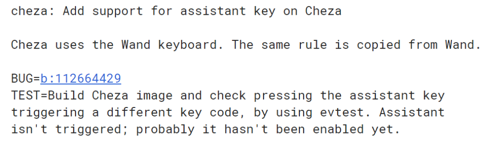
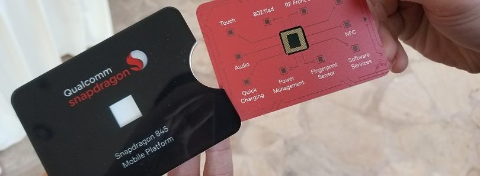
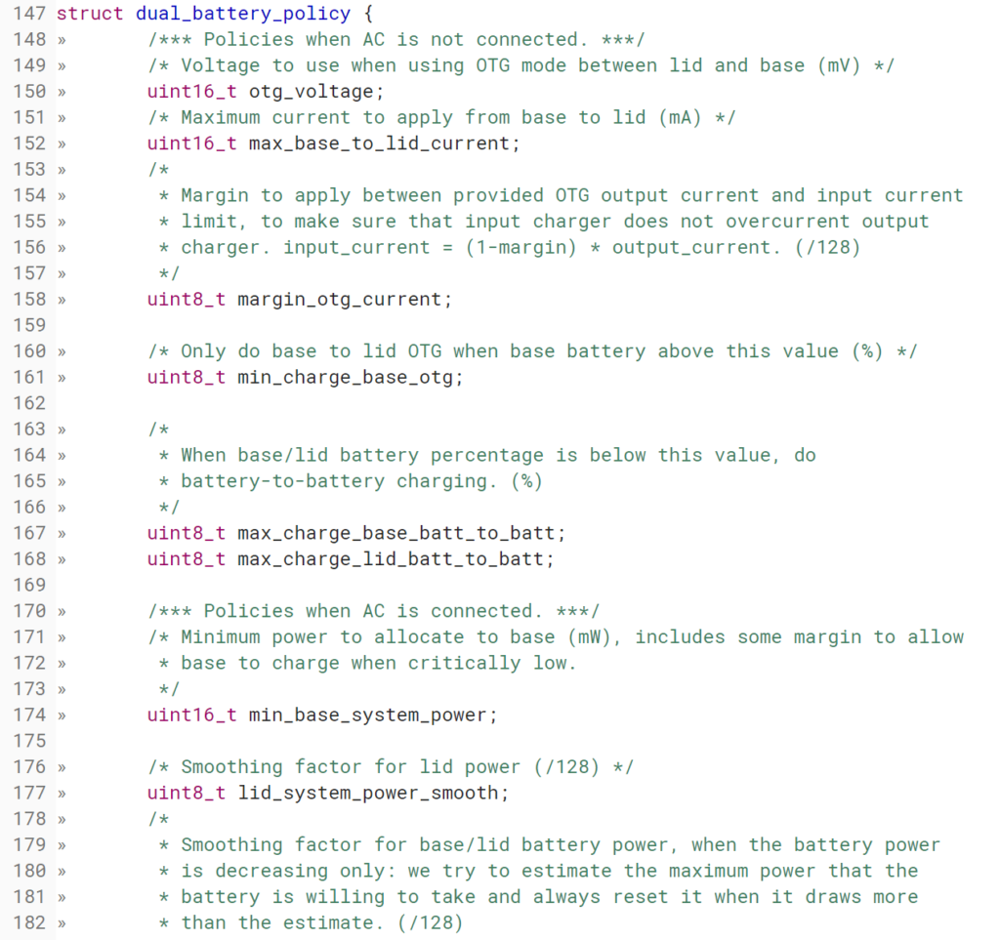

During some digging through recent Chromium code commits I found out something that I previously got wrong. Remember my post on the "Wand" device last month? I thought [Wand was a Chrome OS board](https://www.aboutchromebooks.com/news/wand-detachable-chromebook-with-batteries-in-the-keyboard-base-and-tablet-display/) but it's not: It's a [keyboard base for a Chromebook that will have an "Assistant" key](https://chromium-review.googlesource.com/c/chromiumos/overlays/board-overlays/+/849912/2/overlay-poppy/chromeos-base/chromeos-bsp-poppy/files/61-hammer-keyboard.hwdb). I'll update my prior post to show the correct information.

Speaking of information though, I learned something new about the Wand keyboard. I already knew it will have a battery inside it. So too, will Cheza, the Qualcomm Snapdragon 845-powered Chromebook in the works. It turns out [Cheza will use the Wand keyboard based on this commit](https://chromium-review.googlesource.com/c/chromiumos/overlays/board-overlays/+/1182413). And since it's so obviously spelled out, I know I got this one right. ;)

Since someone -- perhaps Google -- is putting Cheza and Wand together here, what can we put together from this information? The first thing that comes to mind is that all things being equal, the final product will have more run time on a charge than say the [HP Chromebook X2](https://www.aboutchromebooks.com/tag/hp-chromebook-x2/). I'm choosing that device because it's a detachable Chromebook, which I expect Cheza + Wand to be as well.

Why more run time on a single charge? Two reasons.

First, the HP is powered by a Intel Core m3: [The m3-7Y30 to be specific](https://ark.intel.com/products/95449/Intel-Core-m3-7Y30-Processor-4M-Cache-2_60-GHz-). That chip is actually fairly judicious when it comes to power usage: Depending the system load it can range between 3.75W and 7W of power with a base average of 4.5W. That's not bad.

It's almost comparable to a Snapdragon 845, which in testing, [Anandtech saw an average power draw of 1W per core](https://www.anandtech.com/show/12420/snapdragon-845-performance-preview/5). The 845 has four CPU cores, so we're talking about a slightly better 4W or so power draw at maximum. The power consumption difference between the two chips isn't massive, but adds up over the time it takes to run a battery from full to empty. Again: All other things being equal.

\[caption id="attachment\_1490" align="aligncenter" width="810"\] Credit: [XDA Developers](https://www.xda-developers.com/qualcomm-snapdragon-845-pictures/)\[/caption\]

I used an HP Chromebook X2 for two weeks and routinely saw around 10 hours on a single chargein my daily usage. So Cheza being a similar device with a more power efficient chip should last a bit longer assuming a similar battery inside. Heck, the HP Envy X2 PC running on last year's Snapdragon 835, [can run for 12 hours on some tests](https://www.cnet.com/reviews/hp-envy-x2-snapdragon-835-review/2/), so Cheza could possibly meet or exceed that. Much depends again on the battery capacity.

That brings the Wand keyboard into play _**because it too will have a battery**_. We don't know what the battery capacity will be of course, but I'd expect it to be significant because the Chromium team is spending a lot of time and effort [writing code to manage power draws with two batteries](https://chromium-review.googlesource.com/c/chromiumos/platform/ec/+/956661/2/common/charge_state_v2.c). Here's an example:

Let's think about this logically. [Cheza has a detachable Chromebook display](https://www.aboutchromebooks.com/news/cheza-lte-chromebook-detachable-snapdragon-845/) based on the ["detachable" tag in the Cheza overlay code](https://chromium-review.googlesource.com/c/chromiumos/third_party/hdctools/+/1008638/5/servo/data/servo_cheza_overlay.xml). You don't need a battery inside a detachable keyboard base to backlight keys or power a trackpad: Looks at Microsoft's Surface Touch and Type Covers for examples of that. These draw power from the main battery behind the display.

It's not implausible then for the Wand base to have a decently sized battery inside it: Yes, that would add weight but with weight comes some stability so in laptop mode it's less likely to tip back. A moderately sized power pack in the keyboard could easily add four hours of extra time while a larger one could add between six and eight. The capacity is likely a design compromise between weight and added power.

Based on all of the above, I'll take an educated guess and say that whatever the final Cheza/Wand product is, it will allow for at least 18, if not 20+ hours of compute time on a single charge thanks to the two batteries and power efficient processor.

My _only_ caveat to that is assuming the Chromebook is on Wi-Fi for that time. Keep in mind that this device is expected to support LTE since Qualcomm's X20 modem is integrated into the chipset. You'd obviously see less run time on a charge if relied heavily on LTE for your connection.
