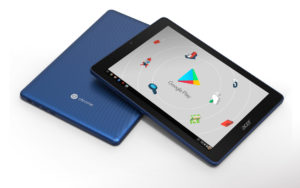
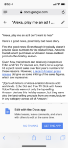

Last week, [Acer announced the first Chrome OS tablet](https://www.acer.com/ac/en/US/press/2018/360016), the type of device I've been hoping to see for about three, if not four years. And during all that time of my pining, people kept asking me, "Why?"

This new device, the [Acer Chromebook Tab 10](https://www.acer.com/ac/en/US/content/series-features/acerchromebooktab10), is perhaps the biggest paradigm shift in the mobile space since Apple's 2010 introduction of the first iPad. How can that be, you ask? The main reason: The Chromebook Tab 10 is the first tablet to combine the now common experience and simplicity of mobile apps with a true desktop browsing experience.

The first point has to do with Android app support through Google Play. Without this, the Chromebook Tab 10 would be like a Chrome OS device from two years ago with the user constrained to living in browser with web apps and extensions. For some people, that's just too limiting.

Android app support, however, brings a nearly infinite number of possibilities to this tablet, just as it does to the Pixelbook I currently use. I'd admit it's been slow going to get a positive app experience on Chromebooks: Android app support was announced in May of 2016 and back then, it was a very hit or miss type of experience.

Fast forward to present day though and it's far better: Not perfect, but it's getting there. While everyone's needs and app choices are different, the Android apps I use on a daily basis work so well on my Pixelbook that I sold my iPad Pro 12.9, for example. And while there's still some work to be done here, it's clear to me that Google's long term strategy for Chrome OS is to [keep improving Android app support on the platform](https://www.xda-developers.com/googletesting-android-p-chrome-os/). So I'm reasonably comfortable in saying that it will get better.

So Android app support tackles one of the key reasons people in the past haven't considered Chromebooks. The "app gap" essentially goes away since there were [3.5 million apps in the Google Play Store as of the end of 2017](https://www.statista.com/statistics/266210/number-of-available-applications-in-the-google-play-store/).

Equally as important for Chrome tablets though is that these are the first tablets running a modern operating system\* to provide a desktop browser. What does that mean?

The best example is one you can do yourself. Try some web apps on your desktop or laptop and compare the experience to that of your phone. It doesn't matter if you use Mac OS X and iOS for this or Chrome on a computer and Chrome on your phone or tablet.

If not immediately, over a short period of time you'll see the limitations of a mobile browser: Moving through different fields on the page, text entry challenges, limited or no support for browser extensions and some features that simply don't work or don't work well.

That's because mobile browsers were designed for mobile activities and input. The base functionality of browsing and interaction is there but it's still limited. This is why there are native apps for software that also runs in the browser. Try Google Docs on the web using a phone or tablet -- if you even can; Google nudges you to download the mobile Docs app -- and you'll likely find that using the Google Docs app is a better experience on mobiles to further illustrate this point.

A true Chrome tablet fixes this issue because it doesn't run the Android version of Chrome; instead it runs "real" Chrome. Those issues and challenges on the mobile browser simply don't exist because it's the same version of Chrome you'd run on a traditional computer. That means if you rely on full-featured web apps on your desktop or laptop, you'll get the exact same experience on a Chrome tablet; it's not watered down.

Combine the broad mobile app support with a full browser experience and Chrome tablets will offer the best of both worlds.

Sure, the Acer Chromebook Tab 10 is targeted for classrooms: Like other Chrome OS devices it's easy to manage, costs $329 and includes a stylus. But in the long term, I expect to see a slew of Chrome tablets in a range of prices for the consumer and business markets as well. They'll get the benefit of a light, portable device that can be used with a wireless keyboard -- although I anticipate we'll see Chrome tablets that detach from a hardware keyboard this year -- along with millions of mobile apps and a powerful, full-featured browser for other activities.

_\* Yes, one could argue that Windows tablets run a modern operating system. But these run a tablet optimized version of traditional Windows; not a new OS that was designed for mobile._
