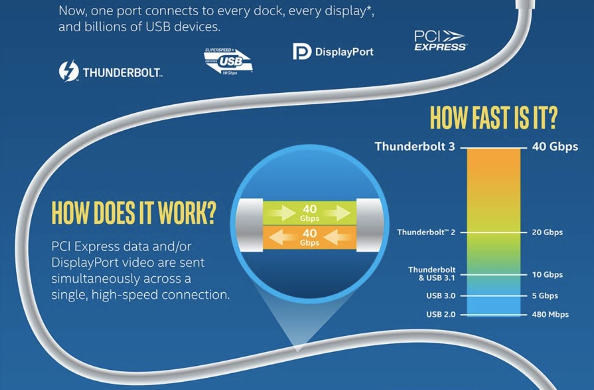
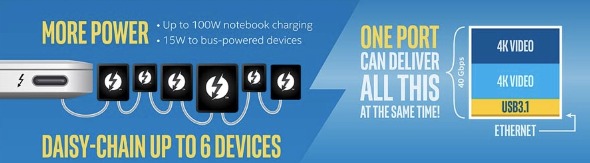
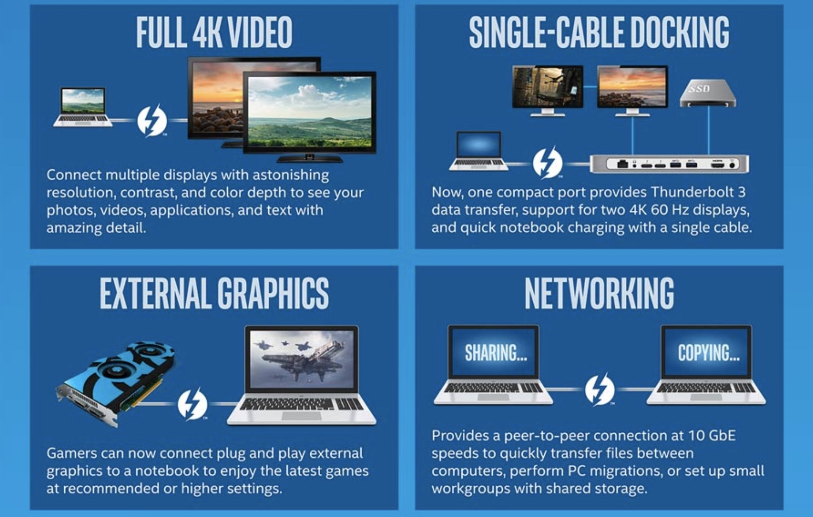

While many Chromebooks now support USB-C and USB-C can work with the Thunderbolt 3 standard, no Chromebooks actually use Thunderbolt 3. You can double check me on Intel's website, which lists [current products that support Thunderbolt 3](https://thunderbolttechnology.net/products).

I mention this observation because of the following emailed reader question from George:

> Why no Thunderbolt 3 outputs on Chrome OS devices? Thunderbolt 3 is a revolutionary connection technology available on Windows and Mac but nowhere to be seen on Chrome OS. Have you seen any indication that Thunderbolt 3 is coming to Chrome OS?

Before sharing thoughts, let's get the basics of Thunderbolt 3 technology out of the way.

 A Thunderbolt 3 port can move data at up to 40 Gigabits per second, which is ridiculously quick for transfer. It also supports multiple 4K external monitors up to 60fps, can supply up to 100W of power and you can daisy chain up to six devices. I agree with George: It is a revolutionary connection technology. So why don't Chrome OS devices use it?There are a couple reasons from what I can see and none of them are technical, although there could be some technical reasons Google hasn't yet adopted it.

First, think about what Thunderbolt 3 excels at: Moving data from one computing device to another, or to external storage. That's not a primary use case for a Chromebook. Instead, users more often move data between the device and the cloud. That doesn't mean there's no value here to add Thunderbolt 3 support to a Chrome OS device but it's not going to add that much value to a wide range of Chrome OS users.

Then there's the Intel aspect because it's Intel that created the technology. Originally, Intel collected royalties for using the Thunderbolt 3 spec, but last year Intel announced that in 2018, [it would make the spec royalty free](https://www.windowscentral.com/intel-drops-thunderbolt-3-royalty). Additionally, the company said it will integrate the spec into future Intel chips.When there were licensing fees, any Chrome OS device maker would have had to pay them, making the device more expensive for (what I suggested above) very little benefit for most users.

Additionally, not all Chrome OS devices run on Intel chips. There are plenty that run on ARM chips from RockChip, MediaTek and Samsung to name a few. I don't expect Thunderbolt 3 to become available on those, royalties or not.And that would lead something I'm not sure Google would want: Hardware fragmentation of sorts for Chromebooks or Chromeboxes that run on Intel chips compared to those that don't.

Regardless, this doesn't mean that Chromebooks will never get Thunderbolt 3 support. In fact, I found one Chromium code commit that [fixes an issue for a Chrome OS device connected to a external display via a Thunderbolt dock over USB-C](https://chromium-review.googlesource.com/c/chromiumos/third_party/kernel/+/1012670). So it's possible that some dock support could arrive, even before any native support.

One last thought from a technical perspective: Chrome OS runs on a Linux kernel and it wasn't until 2016 that the first mainstream Linux device -- the Dell XPS 13 Developer Edition -- [even supported Thunderbolt 3](https://www.pcworld.com/article/3040128/computers/thunderbolt-3-comes-to-linux-pcs.html). Intel says that [Thunderbolt support was introduced in the Linux 4.15 kernel](https://01.org/thunderbolt-sw/overview) and as we know, many Chromebooks and Chromeboxes run a lower version of 3.x. Yes, some newer devices [now have the 4.4 Linux kernel but these are in the minority](https://www.aboutchromebooks.com/news/these-are-the-chromebooks-and-chromeboxes-that-can-support-linux-apps/).

Got a Chrome OS question like George did? [Shoot it over to my email](mailto:kevin@aboutchromebooks.com) and I'll try to answer it.
