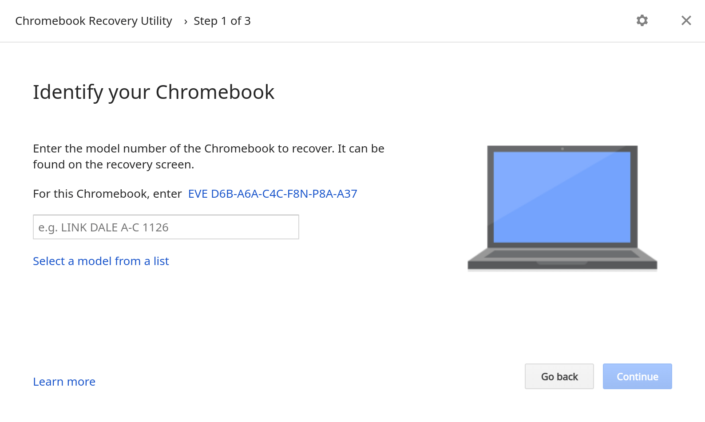
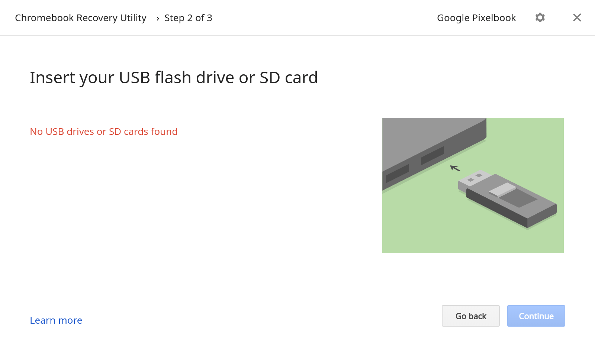

I know, it's sounds silly to make this statement but if you use a Chromebook, I strongly encourage you to carry a USB key or SD card (depending on if your device supports flash memory cards) for one simple reason: In the rare event that your Chromebook needs a full system recovery, _you're going to need it_. And preferably, you'll already have a Chrome OS image on USB stick as well, although that's not a requirement.

It doesn't happen often -- and when it does, you'll least expect it -- but every so often I see folks that have a damaged Chrome OS file system. At that point, they can't boot their Chromebook so they can't Powerwash it to reset it to factory settings. You're just stuck with a non-functioning device.

The fix is easy and doesn't take long, provided you have a USB stick. With it, you can re-install Chrome OS and get back to working fairly quickly. And of course, if you have your Chrome OS sync settings enabled, once you're up and running again, all of your apps, browser history, extensions and so forth will be available.

To get the recovery image on your USB stick, you'll need a Chromebook or a Windows / Mac PC with the Chrome browser. Any of these can get you access to the [Chromebook Recovery Utility](https://chrome.google.com/webstore/detail/chromebook-recovery-utili/jndclpdbaamdhonoechobihbbiimdgai), found on the Chrome Web Store. Once the utility is installed, it's short process to choose your particular Chromebook model and download the appropriate Chrome OS image for it to the USB stick. In the case of a hosed Chromebook, you can boot up with the USB stick and re-install Chrome OS.

Since my Pixelbook doesn't have an SD card slot, I can only use a USB key. And to be honest, even if your Chromebook _does_ have a memory card slot, I'd still recommend using USB because it's more universal. If you need to download an image from a PC, for example, that device is far more likely to have USB ports.

If your Chromebook doesn't automatically go into Recovery Mode so you can restore the operating system, power it down, hold the ESC and Refresh hardware keys and press the power button. Once the device starts up, you can stop holding the keys. For Chrome tablets, like the [upcoming Acer Chromebook Tab 10](https://www.aboutchromebooks.com/news/looks-like-the-acer-chromebook-tab-10-release-date-is-june-or-later/), there isn't a hardware keyboard, so you'll need to press and hold Volume Up, Volume Down and the Power button for at least 10 seconds to enter Recovery Mode.

At that point, just follow the on-screen prompts and use your USB key or SD card to restore Chrome OS. Just remember, to follow the recovery process, you're going to need that external storage device, so it makes sense to keep one handy when you're on the go!
