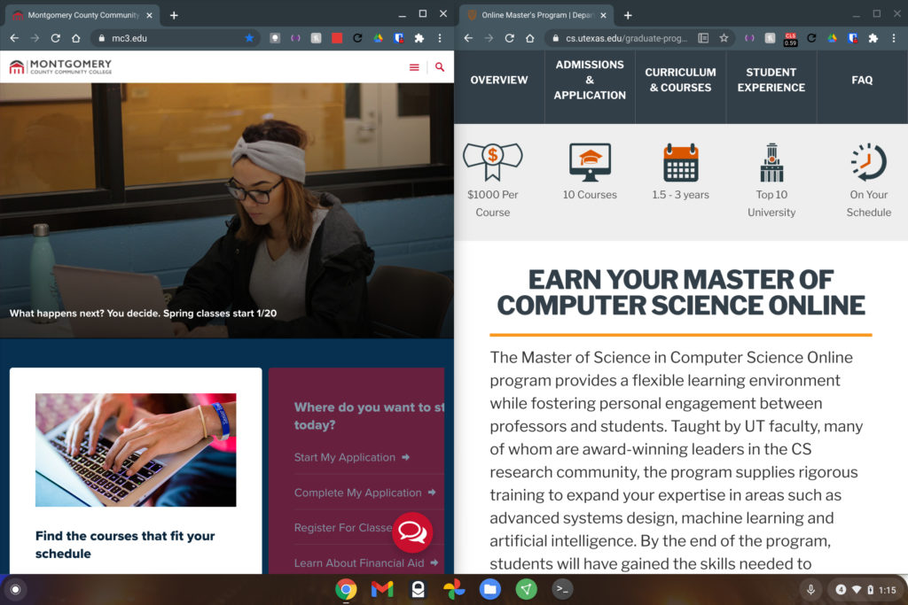
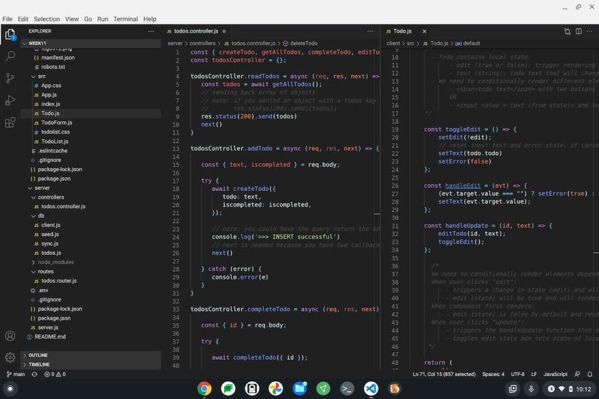

Earlier this week, Android Police noticed some upcoming changes in Chrome OS that will [allow Chromebooks to support vertical displays](https://www.androidpolice.com/2021/06/15/chromeos-is-about-to-get-a-lot-better-with-a-vertical-monitor/). I suspect most of you don’t care but I do. I can’t wait for this feature and aside from explaining why it matters to me, I’ll illustrate a use case that you’ll benefit from as well.

First, the news: According to code commits, future versions of Chrome OS will let you dock or snap windows to the top or bottom of a display.

Currently, the snap feature only allows windows or tabs to be on the left or right of your screen. And that makes sense for a traditional Chromebook display.

But, when using an external monitor that can rotate from landscape to portrait mode, snapping apps to the top or bottom is super useful.

From my perspective and use cases, this will be a godsend for coding. I plan to [use my Chromebook for a Masters in Computer Science program](https://www.aboutchromebooks.com/news/linux-on-chromebooks-just-might-get-me-through-a-masters-in-computer-science/) starting this fall and I already have a rotating monitor.

Using it in portrait mode specifically for coding is vastly superior to viewing code in landscape mode. I can fit much more of the programming text on the screen.

And that’s helpful when tracking down bugs or seeing how different functions work together. With more vertical real estate and the supported snapping, I can even have a debugging window or some other tool open underneath the code.

I need more up and down space!

Of course, we don’t **_all_** do programming on our Chromebooks. But we probably all read website content, yes?

An improved vertical display Chromebook experience will let you reap the benefits to see more of that content without scrolling. Most text on the web is really set up for this viewing experience anyway.

Clearly it’s that way on phones, for example. And most news sites, blogs or other similar web properties are too.

You’ll typically see extra space on the left and right of web content in these cases with a full screen wide monitor for example. On a vertical monitor using a Chromebook or other device, you won’t see that extra space. Instead you’ll see more actual content.

Obviously, if you don’t have an external monitor, let alone one that rotates, you probably don’t care about this upcoming feature. If you do though, you’ll likely be happy to see this functionality arrrive.
