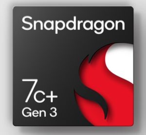
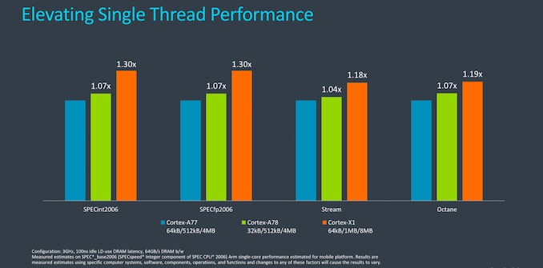

For the past few days, I've been digesting last week's news out of the [Qualcomm Snapdragon Summit](https://www.qualcomm.com/company/events/snapdragon-tech-summit/day-1). Specifically, I've been thinking about Qualcomm Snapdragon 7c+ Gen 3 Chromebooks. Details on the new chipset are few, aside from some promising promises of improved performance over Gen 2 Chromebooks [like the Lenovo Duet 5 Chromebook](https://www.aboutchromebooks.com/news/lenovo-duet-5-chromebook-review-a-better-laptop-than-tablet-but-great-for-the-money/).

However, I have high hopes, mainly because I've been dissecting the reported performance gains against Qualcomm's chip lineup.

Here's the information Qualcomm has provided so far:

> Purpose-built for users across our Windows PC and Chromebook ecosystem, the 6nm 7c+ Gen 3 delivers an up to 60% faster CPU performance and up to 70% faster GPU performance uplift. The Qualcomm AI Engine enables AI-accelerated experiences through 6.5 TOPS of performance, which is unprecedented in the entry tier. The 7c+ Gen 3 also introduces 5G connectivity for the first time in an entry-level platform, raising the bar of accessible connectivity for affordable device users. The integrated Snapdragon X53 5G Modem-RF system supports 5G sub-6 and mmWave– enabling download speeds of up to 3.7 Gbps. The addition of FastConnect 6700 brings multi-gigabit Wi-Fi 6 and 6E with speeds up to 2.9 Gbps

First, the words "entry-level" are used, so I'm not expecting Qualcomm Snapdragon 7c+ Gen 3 Chromebooks to rival current Intel Core performance. At least not when compared against a Core i5 or Core i7. But if the company delivers on its performance claims, compared to the Gen 2 version of the 7c, we might see something between Pentium and Core i3 experiences.

Now, about those performance claims. Qualcomm says this chipset will offer up to 60% faster CPU performance against similar platforms. That doesn't tell us much. [However, the product brief (PDF)](https://www.qualcomm.com/media/documents/files/snapdragon-7c-gen-3-compute-platform-product-brief.pdf) gets a little more specific:

> ~60% multi-threaded CPU performance and ~30% single-threaded CPU performance increase from Snapdragon 7c Gen 2

Now that's useful information and gives us an idea of the actual chips the company could use. Currently, the Gen 2 chipset is comprised of an octa-core Qualcomm Kryo 468 CPU.

More specifically, the arrangement is two Kryo 468 Gold at 2.55 GHz and six Kryo 468 Silver cores. The Golds are for performance while the Silvers are lower-powered efficiency cores, and built on an 8mm process. Gen 1 uses the same configuration but with the Gold cores clocked at a slightly slower 2.4 GHz.

The product brief also states about a "70% GPU performance increase from Snapdragon 7c Gen 2." While Gen 1 used an Adreno 618 GPU, Gen 2 has an Adreno 628, which is slightly faster.

So what does this all suggest?

A 30% single-thread performance increase in the Gen 3 just _**happens**_ to line up with the Cortex-X1 architecture that launched nearly a year ago. According to ARM, who designs the chipset architecture, the [Cortex-X1 is 30% faster than a Cortex-A77 in single-threaded performance](https://www.anandtech.com/show/15813/arm-cortex-a78-cortex-x1-cpu-ip-diverging). And it just so happens that the Kyro 468 in the Snapdragon 7c Gen 2 is based on the Cortex-A77 architecture.

My guess? There's at least one X1 core in the 7c+ Gen 3 chipset because the Cortex-A78 architecture, successor to the A77, doesn't provide those performance claims.

Perhaps a Kyro 690 CPU is the heavy lifter here. If so, that will get Qualcomm Snapdragon 7c+ Gen 3 Chromebooks performance bursts close to mobile Snapdragon 88x performance levels. Currently, the 7c Gen 2 is more in line with the Snapdragon 700 line.

Let's take a look at the GPU side now because we're expecting up to a 70% faster GPU performance uplift. Obviously, the Adreno GPU in the current 7c is getting an upgrade. But to what?

Here the sleuthing gets more challenging. There simply isn't much available information on what GPU this might be. However, when I look at the reported GPU capabilities in terms of gigaflop performance and add 70% to the Adreno 618 GPU, the Adreno 630 numbers are pretty darn close.

So that's my best-educated guess on the GPU side of any Snapdragon 7c+ Gen 3 Chromebooks. Then again, Qualcomm might have a newer GPU that fits the bill but hasn't tipped its hand publicly just yet.

What does this mean, if this is the configuration or it's close to the expected configuration?

Again, don't expect Chromebooks with the 7c+ Gen 3 chipset to perform comparably to a current, high-end Intel Core processor. But you should expect a very usable Chrome OS experience, likely with better battery life than a similar Intel-powered device, that hits the mainstream sweet spot for a Chromebook. I'm thinking more along the lines of a first or second-generation Snapdragon 8c.

Keep in mind that Qualcomm expects to have products with this chipset in the second half of 2022. So there's plenty of time between then and now to keep sleuthing on the chipset architecture. For now, though? I have pretty high hopes with what we know, what we think and the addition of both 5G and Wi-Fi 6!
