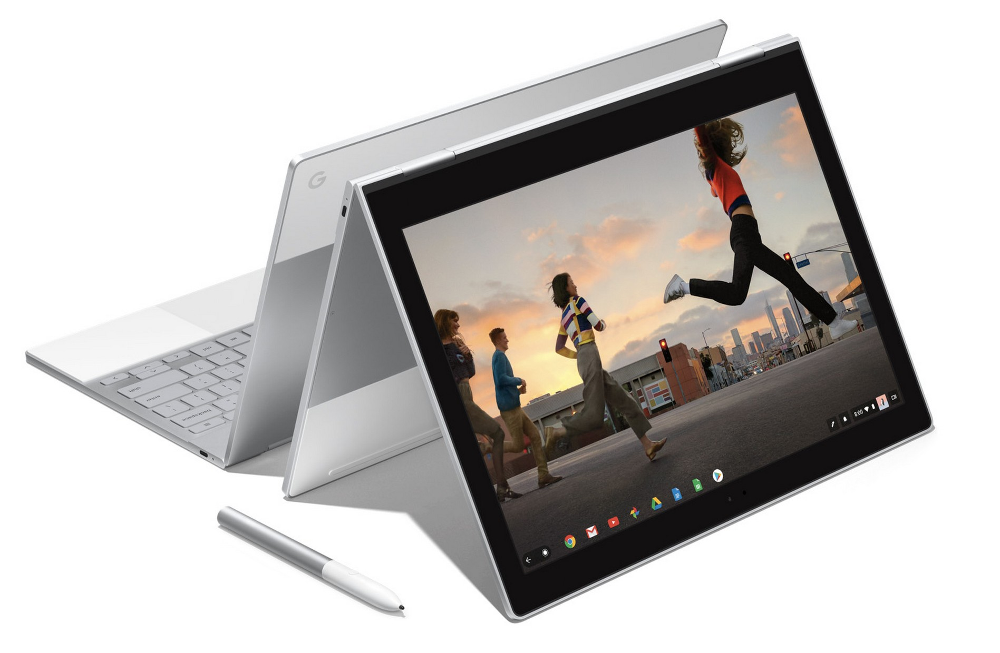
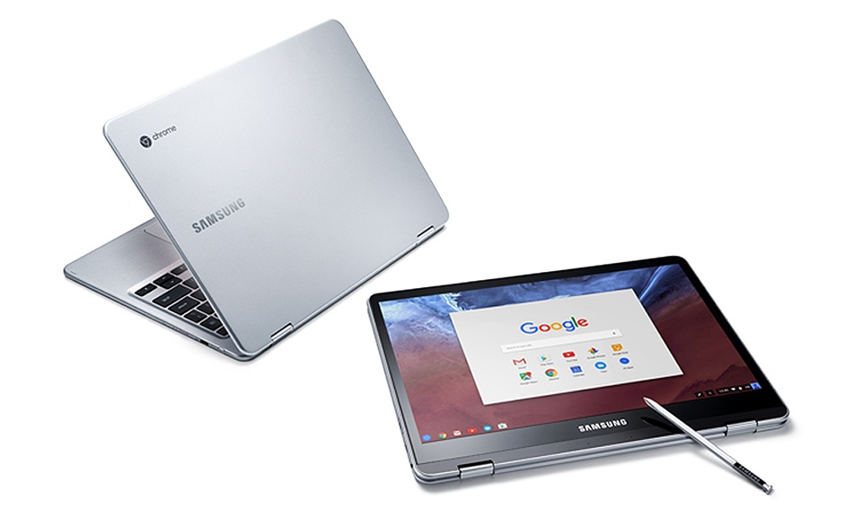

Almost every time I tweet about or mention the Pixelbook I purchased a few weeks ago, I inevitably hear that the device costs too much. Often, the assumption is centered around this theme: "Google said Chromebooks were supposed to be cheap."

Except, Google never said that as it applies to _all_ Chromebooks. The devices are aimed at different markets -- consumer, education and business -- all of which have different budgets and expectations. And Google doesn't set the prices for a Chromebook other than the ones that it makes, which traditionally have hovered at or above the $1,000 mark. Chromebooks from Acer, Asus, Dell, HP, Lenovo, Toshiba and other manufacturers are priced by those manufacturers.

So how did we get here to this inaccurate mindset?

For the first few years, Chromebooks _were_ relatively inexpensive. The laptops were first powered low-end Intel Atom and Celeron processors, later joined by ARM-based chips, the same kind you find in a smartphone. And generally speaking, those are less expensive than chips from Intel. So that started an assumption that all Chromebooks would and should be cheap.

<iframe style="width: 120px; height: 240px;" src="//ws-na.amazon-adsystem.com/widgets/q?ServiceVersion=20070822&amp;OneJS=1&amp;Operation=GetAdHtml&amp;MarketPlace=US&amp;source=ac&amp;ref=tf_til&amp;ad_type=product_link&amp;tracking_id=aboutchromebo-20&amp;marketplace=amazon&amp;region=US&amp;placement=B075JSK7TR&amp;asins=B075JSK7TR&amp;linkId=30ffea6a853e802502bba14a51ccd2ff&amp;show_border=true&amp;link_opens_in_new_window=true&amp;price_color=333333&amp;title_color=0066c0&amp;bg_color=ffffff" width="300" height="150" frameborder="0" marginwidth="0" marginheight="0" scrolling="no" align="right"> </iframe>

These Chromebooks were also less powerful than what you find today, but they've evolved. Instead of solely a Chrome browser with everyday web apps, Google evolved the platform so developers could target Chromebooks for richer apps and extensions found in the Chrome Web Store. And in May of 2016, [Google introduced support for Android apps](https://www.blog.google/topics/connected-workspaces/empower-your-workforce-android-apps-chrome-devices/) to extend Chromebook functionality even further. Put another way: The Chromebooks of today are far more capable than the early models. That capability comes at a cost.

So too does the wide range of hardware you can now purchase. Sure, you can still buy a smallish 11-inch display with relatively low resolution. But now you can find Chromebooks with up to 15-inch screens and resolutions pushing beyond 1080p: The Pixelbook display is 2400 x 1600, for example. Oh and the addition of touchscreens doesn't come for free either.

You don't have to spend nearly a grand to get a Pixelbook-like experience though. The [Asus Chromebook c302](https://amzn.to/2GuADnZ) (_affiliate link_) is half the cost but still supports Android apps, has a 1080p touchscreen and the display folds over for tablet mode. You'll give up some performance based on the older Intel chipset, but it's still a very capable device. The same follows for the Samsung Chromebook Plus and Pro models, both of which also include a stylus and can be had for around $400 to $500: The main difference between the two is the choice of an ARM processor or a Intel chip.

What people are missing in this debate is that Google has always focused Chrome OS and Chromebooks on what it calls the "three S's": Simplicity, Speed, and Security. There's no mention of an "i" or "c" for inexpensive or cheap in that definition. And like all other computing devices, Chromebooks are priced according to the hardware inside them and the robustness of the features and experience. As you add more features, the costs go up. It's that simple.

That doesn't address the question of "why should I spend $1,000" on a Chromebook of course. That's a personal choice and there's no wrong answer.

But if you're the IT director of a school, it's pretty simple to determine this: You don't want or need to spend that much per student. Instead, you want low-cost, and possibly rugged, devices for a large number of students to get online and access their mail, homework and research information. However, for a business organization that requires more performance, nicer displays and the ability to run dozens of Chrome tabs, it may make sense to spend $500 to $1000 on a Chromebook.

Simply put: There are Chromebooks at various price points that are good choices for a range of use cases and environments. As for me, I use my Pixelbook as a primary device: Both for work in laptop mode and for mobile apps in tablet mode. It's like I have two devices with each one meeting my personal needs. For that I'm willing to spend more money without regret.
