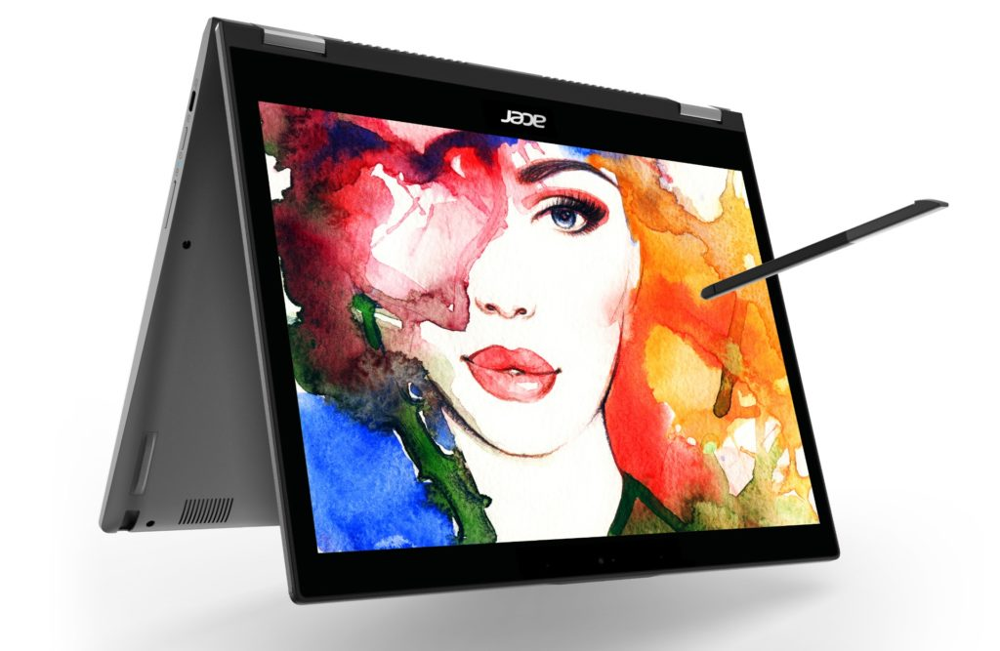
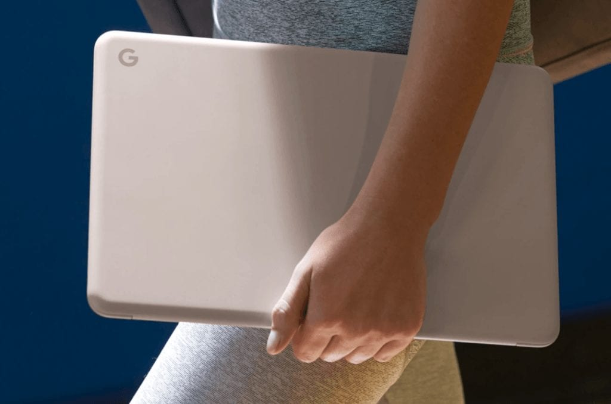
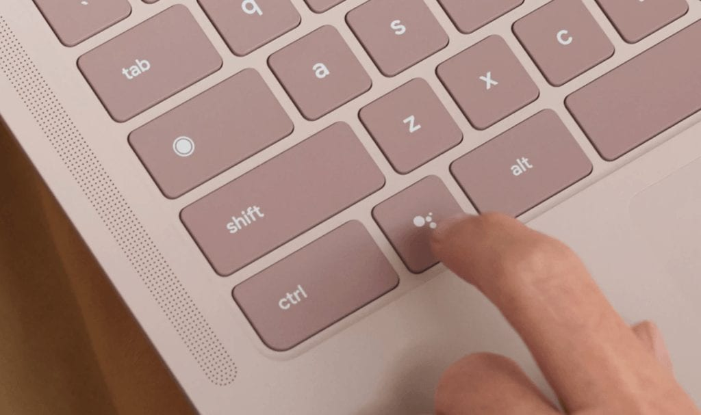

After a hectic [Tuesday trip to New York City to see the Google's latest hardware efforts](https://www.aboutchromebooks.com/news/pixelbook-go-launch-pricing-specifications-pixel-slate-laptop/), I've finally caught my breath again. It didn't help that I had to take my wife to the ER between then and now due to her experiencing chest pains. That's all resolved now - she's fine - so I can share some additional early thoughts on the Pixelbook Go, what I'm effectively calling a "Pixelbook for the masses."

Many of those thoughts come by a way of a conversation I had yesterday with Ben Janofsky, Senior Product Manager in Google's hardware division. We had a candid conversation about the Pixelbook and Ben was kind enough to answer some of my lingering questions about the device, which can be [pre-ordered for end of month delivery, starting at $649](https://store.google.com/product/pixelbook_go).

First and foremost, Janofsky told me, was that the 2017 Google Pixelbook far exceeded Google's sales expectations. Even with a starting price of $999, I can see that. The Pixelbook has a fantasic design, is made with quality materials all around and, at the time, was the most powerful Chromebook one could buy.

Given that though, I asked if the Pixelbook Go was ever considered to be a more potent sucessor. After all, I've tracked development on [Atlas, the baseboard used for the Pixelbook Go over the last 18 months](https://www.aboutchromebooks.com/tag/atlas/): One of the first known details was [support for a 4K display](https://www.aboutchromebooks.com/news/chromium-code-suggests-4k-chromebook-code-named-atlas-in-the-works/), which alluded to the strong chance of an even more powerful Pixelbook.

Janofsky says no, the Pixelbook Go was always to offer Pixelbook performance at a more affordable price, so that Google could provide a less expensive model for broader appeal. I'm still raising an eyebrow slightly at that thought though.

When development of Atlas began, Google still owned the high-end Chromebook market. But the Pixelbook did its job by showing that there was demand for high-performing Chromebooks and later in 2018, we saw a slew of what I'd call Pixelbook competitors in that market. Think [Acer Chromebook Spin 13](https://store.acer.com/en-us/chromebook-spin-13-cp713-1wn-37v8), [Lenovo Yoga Chromebook 630](https://www.lenovo.com/us/en/laptops/lenovo/lenovo-n-series/Yoga-Chromebook/p/88YGCC61096) and [HP Chromebook X360](https://store.hp.com/us/en/pdp/hp-chromebook-x360-14-g1-notebook-pc-customizable-5mg05av-mb) in some configurations.

In my mind, it's possible that Google saw its hardware competitors enter the "Pixelbook market" and shifted the Pixelbook Go strategy. Janofsky assured me that's not the case and that Google doesn't see its hardware partners as competitors.

Instead, the Pixelbook Go would bring relatively high performance at a more palatable price, along with Google's design chops and other goodies. That 12 hour battery life, for example, is one of those. More importantly though may be the quick charge capabilities of Pixelbook Go.

Janofsky told me that he uses a Pixelbook Go and recently the device wasn't plugged in overnight, so he only had a 50 percent battery when heading to work. Thanks to the quick charge feature, he wasn't concerned: A 20 minute top off adds 2 hours of battery life.

From a design perspective you still get much of the Pixelbook look, feel and build quality: A high resolution touch screen, thin profile, light weight, great (if not improved) keyboard and super trackpad. And Janofsky agreed that there are Pixel Slate design cues as well: The rounded corners of the Pixelbook Go chassis look identical to those on the Pixel Slate. And those hush keys of the Google Pixel Slate Keyboard have made their way into the Pixelbook Go keyboard as well.

You give up a 360-hinge and stylus support with the Go, but those aren't important features to everyone, Janofsky noted, and these also help keep costs down. So too does using the same eight-generation Intel Y-Series chips as you'd find in last year's Pixel Slate. They provide a slight performance bump over the original Pixelbook and they're certainly powerful enough for the target audience of the Pixelbook Go.

I told Janofsky that I don't think the Go is for me, mainly because my coding activities are better suited with the [Acer Chromebook Spin 13 with 16 GB of memory that I recently purchased](https://www.aboutchromebooks.com/news/acer-chromebook-spin-13-with-16-gb-ram-should-you-buy-one/). I'm sure any developers who were looking for a higher performing Pixelbook 2 are in the same boat. However, this group is a relatively small segment of the Chromebook market. And as I noted earlier, there are plenty of other Chromebook choices for this segment now.

Another key question I had for Janofsky was how long will the Pixelbook Go be supported with Chrome OS updates. I asked because Chromebooks are typically supported for 6.5 years although that clock starts ticking when a Chromebook on a new chipset platform launches. And if that's the case, the Pixelbook Go has already lost some of that time given that the 8th-gen Intel Core chips have powered Chromebooks since 2018.

Janofsky acknowledged that this limitation is important to Chromebook buyers and told me that the AUE, or automatic update expiration date would be pushed out for the Pixelbook Go, as well as other devices using the 8th-gen Intel processors.

Currently, the [Pixel Slate shows an AUE date of June 2024](https://support.google.com/chrome/a/answer/6220366?hl=en) but it's possible that another two years could be added to that for both the Slate and the Pixelbook Go, Janofsky said. Expect Google to update the AUE dates in the coming weeks to see how long of an extension these devices will get.

My Pixelbook Go review unit arrives later today, so I'll approach the device from a mainstream audience perspective. Don't get too excited looking for early reviews: None will be posted until late next week per Google's instructions. I'm OK with that because I don't like to make snap judgements for reviews. I prefer to live full time with a device for a good week before I gather my thoughts.

Is Pixelbook Go the Pixelbook 2 that most, if not all, of us die-hard Chromebook users expected? Nope. That's evident by the internal hardware and the starting price.

Will some Chromebook shoppers bypass the Pixelbook Go in favor of higher performing devices that can be had at a similar or even lower price? Probably. Competing choices in this category are the [Asus Chromebook Flip C425](https://amzn.to/33GCFbR) and the 2-in-1 [Dell Inpiron Chromebook 14](https://www.dell.com/en-us/shop/dell-laptops/inspiron-chromebook-14-2-in-1-laptop/spd/inspiron-chromebook-14-7486-2-in-1) to name a few.

Is there a market for Google-designed Chromebooks with solid performance, long battery life, high quality build materials and a nearly silent keyboard though? Google thinks so and hopes that is nameplate, device quality and support will sway some buyers to one of the lightest and thinnest, good looking Chromebooks with a smidge of premium pricing.
