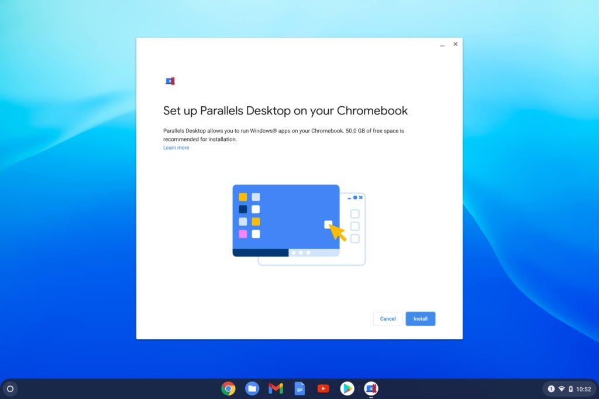
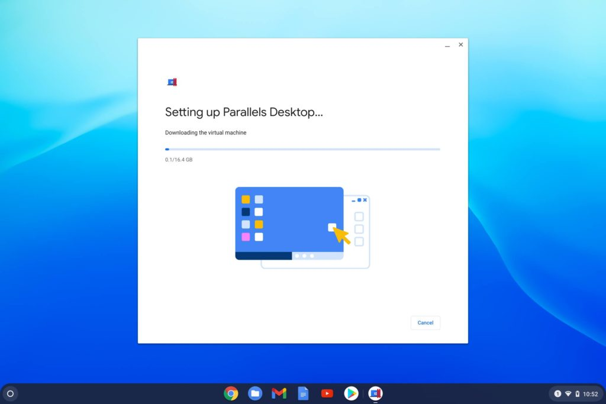
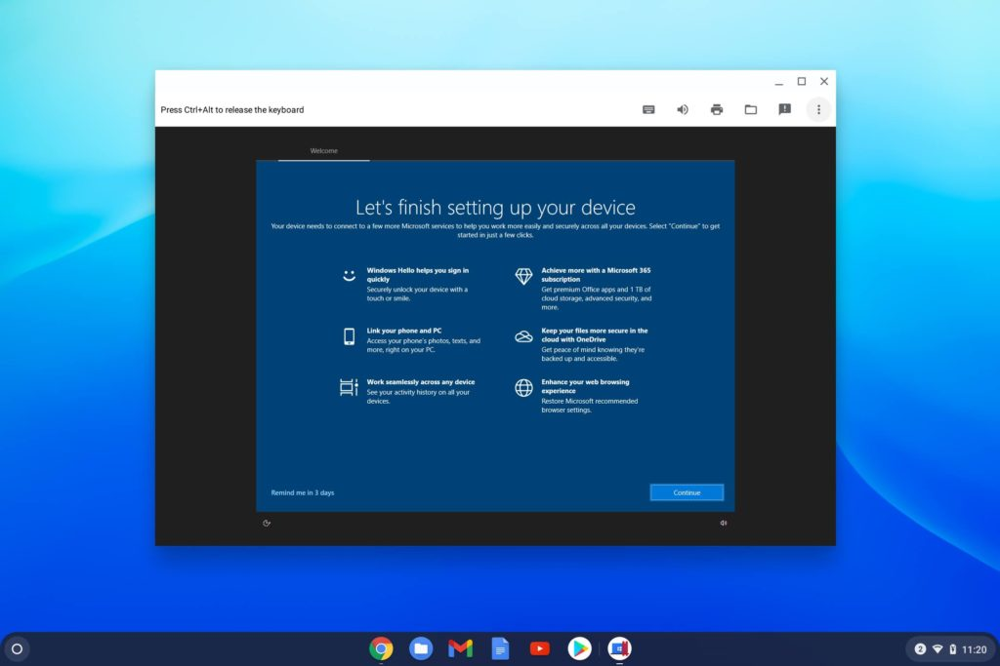
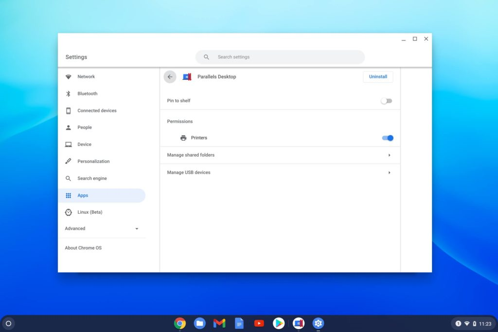
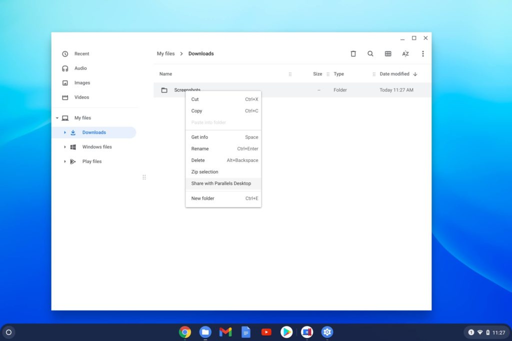
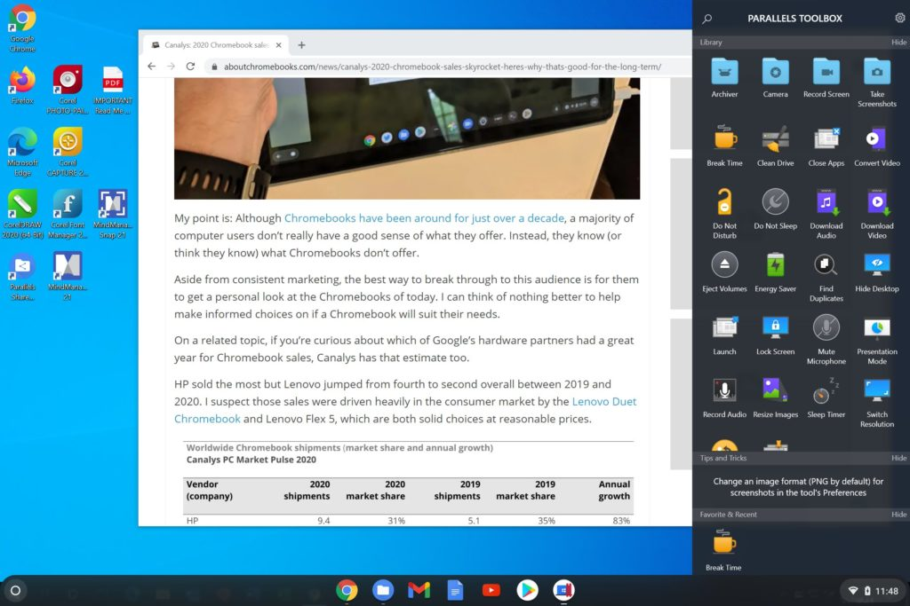
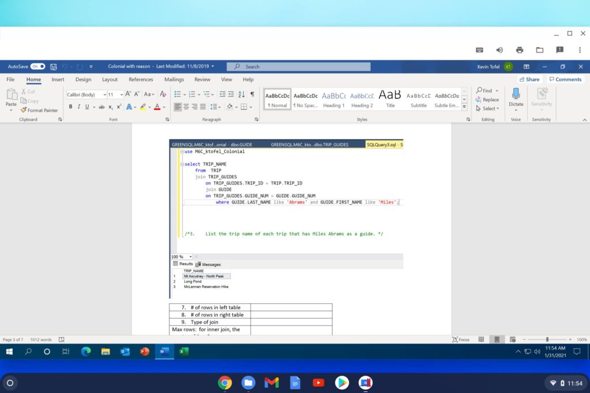
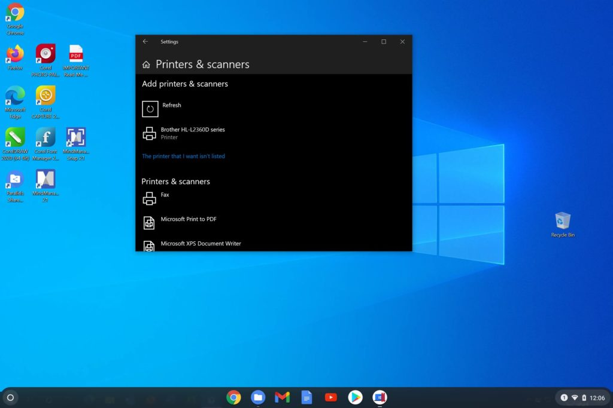
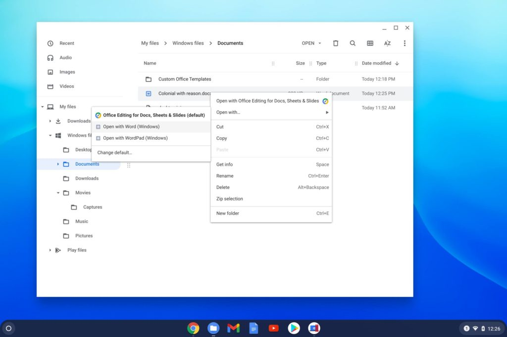

Back in July, [Google announced a partnership with Parallels to get Windows on Chromebooks](https://www.aboutchromebooks.com/news/enterprise-chromebooks-windows-office-desktop-apps-parallels/). The software became available in October, and I recently got review access to the virtual machine solution.

To be honest, it's pretty slick if you have a supported Chromebook. Parallels Desktop for Chromebook Enterprise could help companies migrate to Chrome OS for most of their work and still provide access to any Windows software as well.

Just to level-set my comment about the "supported Chromebooks", Parallels has mid-to-high-end range system requirements.

You'll need at least a Core i5 processor, 8 GB or more of memory, and 50 GB of free storage capacity. Chrome OS 85 is also needed, but that should be a non-issue these days for most Chromebooks.

## What your Chromebook needs for Windows and Parallels Desktop

I ran my tests on the [Acer Chromebook Spin 13 with 16 GB of memory that I bought back in 2019](https://www.aboutchromebooks.com/news/acer-chromebook-spin-13-with-16-gb-ram-should-you-buy-one/) because it exceeds these requirements, even if it's not the newest device. It also has the minimum of 128 GB of storage capacity. 64 GB won't likely cut it once you have the Chrome OS image and/or anything else such as Android apps or the Linux container installed.

For reference, the Parallels Desktop virtual machine (VM) image that includes Windows 10 is a 16.4 GB download.

## The Parallels Desktop setup experience on a Chromebook

Luckily, I have a 1 Gbps fiber connection to the web, so my download took less than 10 minutes. The self-configuration process took less than another 5 minutes. Note that my review access included a demo license for Windows 10 as well as a few desktop apps.

You'll need to supply your own software licenses for Windows or any other desktop titles to use Parallels Desktop for Chromebook Enterprise.

After the configuration process completed, I was greeted by the Windows 10 boot-up process in the VM and then of course, the full Windows desktop.

There are a few shortcut buttons to access Chrome OS file sharing, printers, keyboard shortcuts in Windows and to enable or disable sounds from the VM. With sound on, I was able to watch and hear YouTube videos from Windows on my Chromebook, for example.

In this image, I have the VM a window, but it works in full screen as well.

Upon first boot, there were some Parallels VM updates to be downloaded and installed, which required a restart of the VM; I didn't have to shut my Chromebook down as all updates were done to the VM, not my hardware. I think the process was actually quicker here than what I experience on [the heavy-duty gaming Windows PC I built](https://www.kctofel.com/so-i-hit-the-nvidia-rtx-3080-lottery/)!

## Chrome OS integration with Parallels Desktop

Before getting into how Windows 10 in Parallels Desktop for Chromebook Enterprise is to use, I should note that this isn't just a standalone VM app. There's some Chrome OS integration as well, just like there is for Android and Linux.

Here in the Chrome OS Settings, you can see hooks to printers, USB devices, and shared folders for the VM to access.

You can, for example, right-click on a folder in the Chrome OS Files app to share it with Parallels Desktop. You'll also see the default user folders from Windows in the Files app, to get at those from Chrome OS. It's more seamless than I expected.

## Resources for the Virtual Machine and Windows

It also appears that Parallels allocates 4 GB of memory, at least initially, to the Windows instance based on checking the "Windows PC" information.

Since this is a managed application, I don't see any settings that will allow for customization of the VM resources. And although this screen says there isn't any pen or touch input configured for Windows, I actually _**can**_ use my finger and the Chromebook touchscreen to interact with Windows.

Of course, the trackpad and keyboard on my Chromebook works as expected. And using Windows 10 in a VM on a Chromebook is little different from using Windows on a PC or any other operating system in a VM. Best of all, you can use Windows 10 on a Chromebook with this solution without an internet connection.

That's a good selling point here although many Chromebook functions and features can be used offline.

The problem is that most people don't know or understand that. And to be honest, there are few things you might do these days without being connected to the internet. Word processing and note-taking, photo or video editing, or watching downloaded content all come to mind. Still, this is nice to see.

Also nice is a full suite of utilities available in the VM called Parallels Toolbox. Here you get a plethora of useful tools to improved the overall experience. Oh, and you get both Microsoft Edge and Google Chrome installed for web browsing: Using the web from Windows in the VM worked 100% of the time during my test usage.

## Testing the usage experience

For testing, I ran several of the full Office desktop apps, as those are a mainstay for company's that run Windows PCs, plus a few other apps.

I was able to sign in to my student account with Microsoft and use OneDrive to pull up some old documents from my database class for example. This gave me the full-featured Word experience on my Chromebook, which I could have used during the class.

Even though I use a Chromebook for all of my coding coursework, the database professor required everything is done in Windows, _including_ Word documents for homework.

I had to use a lab PC for those; had I been able to use Parallels Desktop, I could have simply used my Chromebook. Note that in the below image, I'm not using Windows in the full-screen experience even though it's better; I wanted to make sure you see that Windows and Word are running on the Chromebook.

Overall, there wasn't really anything I couldn't do in Windows on my Acer Chromebook Spin 13 that I can't do on my Windows PC.

And the seamless integration with Chrome OS is a treat: I had no problems saving files in Windows and then accessing them in Chrome OS. I even printed out some Word docs to my wireless Brother printer directly from Windows.

And when I accessed a Word file in my Chromebook Files app it showed me Word as a way to open it. Clicking that fires up the VM (if it's not running) and opens the document right in Word.

Even with the VM shut down completely, I was able to view and edit my document in about 20 seconds.

## Summary: This is an excellent solution for those that need Windows

About the only downside I can see is if you really want to live in Windows all day on a Chromebook. Meaning: You spend more time in Windows and want to use multiple applications for hours.

Yes, you _can_ do that, but the 4 GB of RAM allocated to the VM is a bottleneck in that case. Having one app open as needed in Windows is perfectly fine. Start stressing Windows with multiple apps and that system memory gets gobbled up quickly, causing some system slowdown and lag.

But again, that might be configurable by whoever manages the IT department. I suspect it would be. If not, I hope it's an added feature in the future.

And frankly, if that's the worst part of the experience here, I think this collaboration between Google and Parallels is a home run for companies that can use the security, speed, and simplicity of Chrome OS while hopping over to Windows for any required desktop apps.

Keep in mind that at the moment, this is an enterprise offering. Aside from the cost of a Windows license (existing license keys can be used here), as well as any other desktop software, Parallels charges $69.99 annually for the VM.
