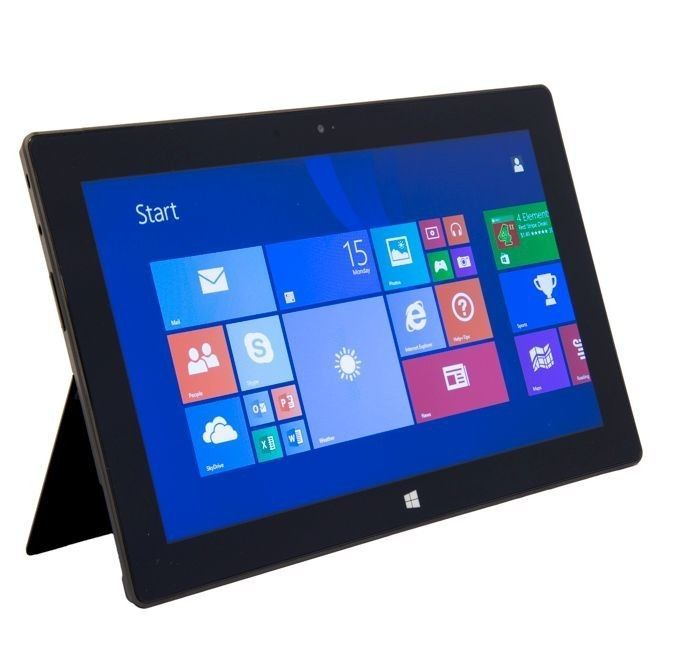
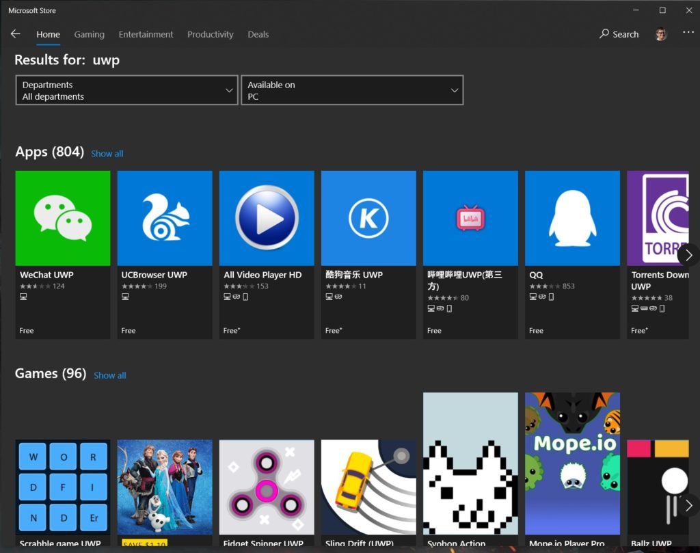
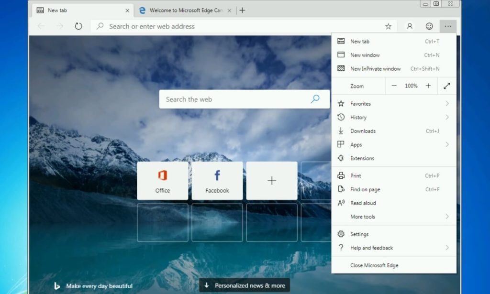
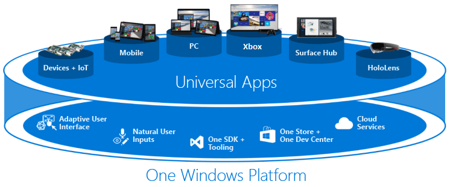
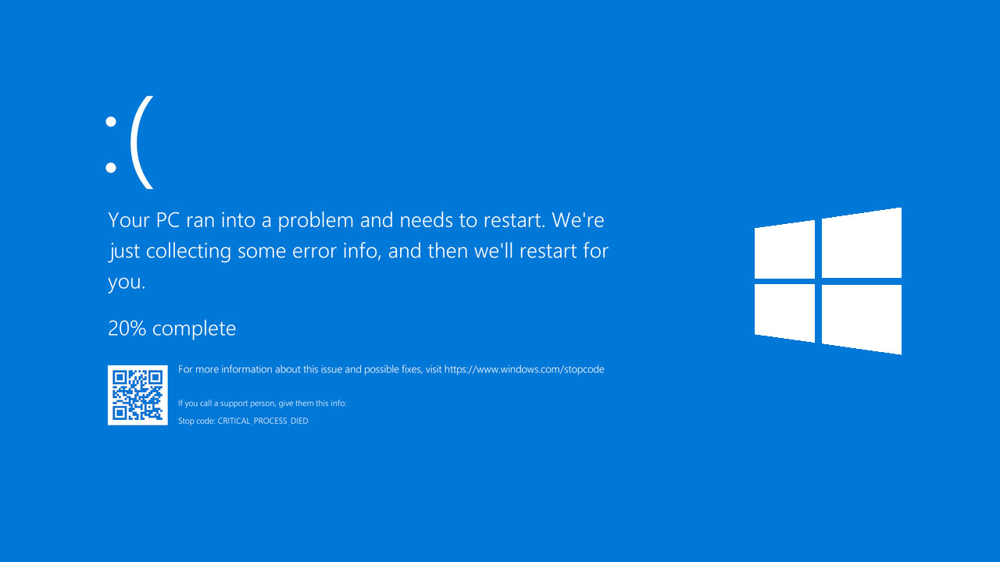

Stop me if you've heard this before: Imagine an operating system that's focused on using the web browser and you can't install traditional desktop apps on. No, I'm actually _not_ talking about Chromebooks, and if I was, that would be an outdated thought experiment since you can [install full desktop Linux apps on Chrome OS](https://www.aboutchromebooks.com/tag/project-crostini/). I'm talking about upcoming devices running [Microsoft Windows 10X, a "lite" software platform that is reportedly debuting in roughly 9 months](https://www.zdnet.com/article/microsoft-plans-for-single-screen-windows-10x-rollout-in-spring-2021-dual-screen-in-spring-2022/).

You may not recall that Microsoft tried a similar approach in 2012 with Windows RT and the first Surface device.

Indeed, it reminded me much of what I like about Chromebooks: A simplified user experience, a good productivity suite, and something else not available to Chromebooks at the time, a dedicated app store. Chrome OS later added support for Android apps through Google Play and the selection of software is exponentially broader than what Microsoft Store offered to RT users. Overall, however, I really did like where Microsoft was going with Windows RT.

Alas, it didn't take off and Windows RT was essentially dismantled in 2015. Now it looks like Windows 10X is a newer, more modern iteration of the RT vision.

So what's expected if you get a Windows 10X device?

A great browsing experience, with the obvious choice being Edge. That's good, given that Edge is based on Chromium, as is the Chrome browser you run on Chromebooks today. I'd say Chrome is actually getting and will continue to get better as Microsoft contributes to Chromium.

"Native" apps will be in the form of Microsoft's Universal Windows Platform (UWP), which is the company's effort to reduce code rewriting. In the UWP world, you can develop an app in any supported programming language and it will run on Windows, Android, or iOS, for example.

Given that Microsoft is now an official Android partner to Google, it's possible -- likely, even -- that Windows 10X users could have Google Play support on their Windows 10X devices. That would certainly help the platform's cause, but it's not a differentiator to Chromebooks.

Eventually, Win32 apps may be supported on Windows 10X through containers, similar to how Android and Linux are supported on Chrome OS today. Or perhaps those legacy desktop apps will be made available remotely. Regardless, this is the biggest challenge Microsoft will have to overcome if it wants Windows 10X devices to be appealing Chromebook alternatives.

Why? For the same main reason Windows RT died a slow painful death: People didn't want a Windows device that couldn't run traditional Windows apps.

Let me put it a different way, in an admittedly arguable point. How many people use Windows because they actually like Windows as compared to people who use Windows because they want or need to run Windows desktop apps?

Nobody knows the actual answer in aggregate of course. However, you can look at current non-Chromebook buyers to get an idea.

When people scoff at Chromebooks incorrectly by calling it "just a browser" or say "I can't do my work on a Chromebook" (and I don't argue with them on that point, it's very possible a Chromebook won't meet their needs), they generally add "...... because I can't run \[INSERT WINDOWS APP HERE\]."

It could be Photoshop, the full version of Office, some PC game title, a high-compute 3D modeling or scientific app, CAD software, etc.... you get the idea.

I have yet to hear someone say "...... because I **_really_** enjoy using Windows."

I'm _not_ saying there aren't people who enjoy Windows. I know they're out there. But I'd posit that _most_ people use Windows because it's the only game in town for the apps that they want or need to use.

And that's a huge hurdle for Windows 10X based on the reports we have today.

Perhaps Microsoft can overcome it; I've learned never to bet against the company. But that's a big "if" right now. And if Windows 10X doesn't overcome that challenge, I don't see it becoming a major competitor to Chrome OS devices. How can it be when Microsoft has the same hardware partners as Google?

Th;ink of this way: If you're a Acer, Asus, Dell, HP, or Lenovo you're already making Chromebooks. You can probably reuse much of the hardware design from those devices for Windows 10X, so there's some cost savings there. But will the retail price points differ between a similar Chromebook and a Windows 10X device? I doubt it.

At that point, **_what's the reason for a potential Chromebook buyer to choose a roughly equal-priced Windows 10X device_**?

Without Windows apps, there isn't one. And as Chrome OS gains more capabilities and ways to run apps, there's little incentive to choose a platform with fewer app options. Sure, Microsoft can avoid some of this with Windows apps in a container, but the better Chrome OS becomes, the more options away from Windows apps there are.

It's a tough situation for Microsoft and although I'm intrigued by what the future will bring to Windows 10X, I'm not sure it will be an appealing Chromebook competitor for the masses.
