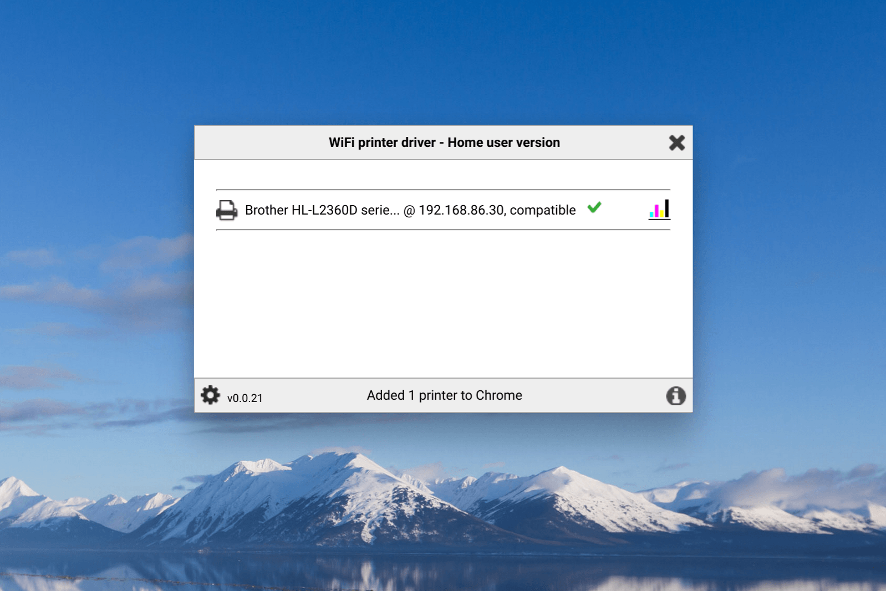
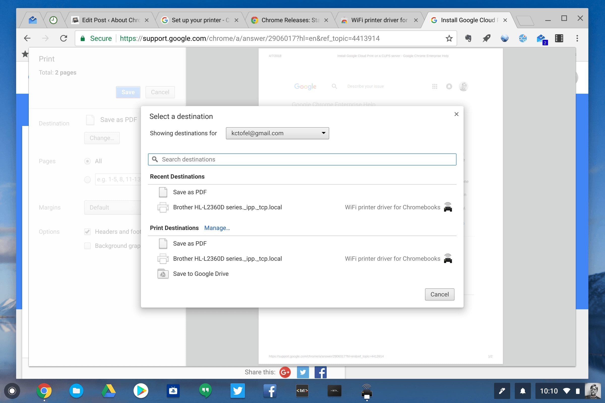

Printing from a Chromebook hasn't always been easy. So last June, [Google added a Chrome OS Native Printing feature for Chromebooks](https://chromereleases.googleblog.com/2017/06/stable-channel-update-for-chrome-os.html) since not everyone has a Google Cloud Print capable device. Even so, I've still seen inconsistency when trying to print, especially after we replaced our older HP printer with a Brother model.

After some research, I found the [WiFi Printer Driver Chrome Web App](https://chrome.google.com/webstore/detail/wifi-printer-driver-for-c/hhcgnlnhaapiekdelngjichnccjfkbnc) and since then, I haven't had a single printer issue. And it doesn't require you to [know the IP address of your local network printer](https://support.google.com/chromebook/answer/7225252), which saves some configuration time.

 Your results may vary based on the printer model you have, of course.

But in scanning through the app reviews, I see a wide range of success across different printer brands including HP, Canon, Epson, and Brother, to name a few.

One thing I have noticed is that the WiFi Printer Driver app needs to be actively running in order for me to print. It's a minor annoyance at best though. And depending on which printer you have, you might not need the app to be active when printing.

Regardless, if you have a wireless printer that doesn't consistently work with your Chromebook, this app is worth a try.
