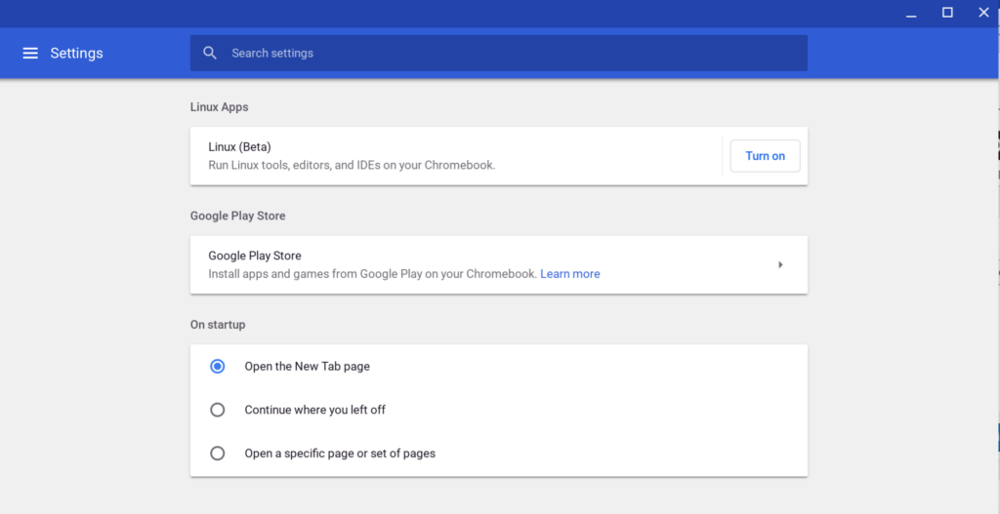
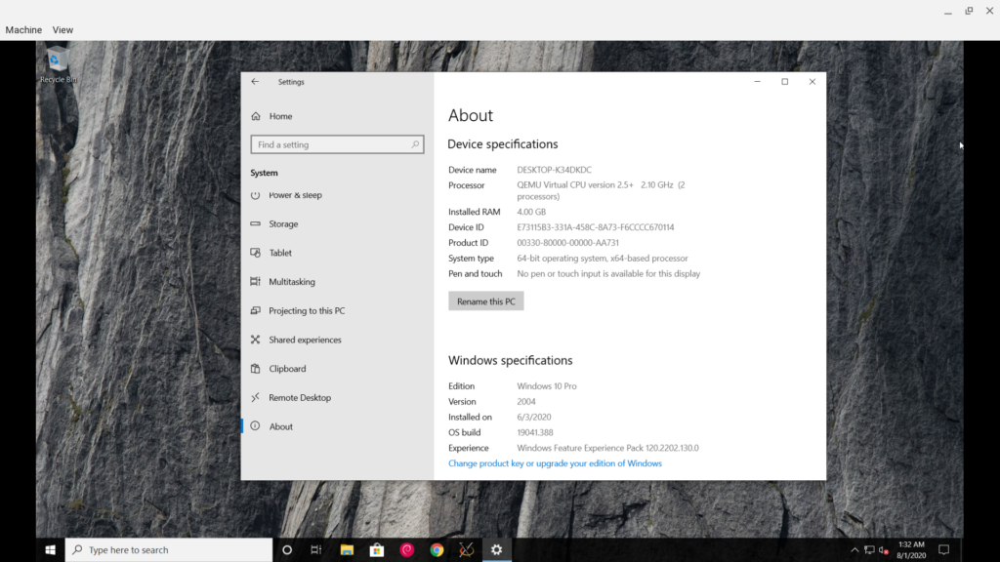

Back in 2009 [at the debut event for Chrome OS](https://www.aboutchromebooks.com/news/chrome-os-is-10-years-old-heres-the-first-demo-from-2009/), Sundar Pichai said Chromebooks would focus on the "three S's": Security, speed, and simplicity. And the first devices were indeed simple to use; if you knew how to use the Chrome browser, you knew how to use a Chromebook. Since then, Android apps arrived in 2015, [followed by Linux containers](https://www.aboutchromebooks.com/news/google-officially-unveils-project-crostini-linux-apps-on-chrome-os/) and, most recently, [news of Windows 10 in a Parallels virtual machine](https://www.aboutchromebooks.com/news/heres-how-youll-be-able-to-run-windows-apps-on-chromebooks/). With each one of these bolt-ons to Chrome OS, I heard people say something along the lines of, "I don't want all that, I just want the simple experience of the Chrome browser."

I completely understand that sentiment, but I also think its a bit overstated.

Why? Because all of these additional features are completely optional. If you don't want one or more of them, you don't have to enable them, let alone use them. Yes, you might see some settings that are specific to Android or Linux, for example, in the Chrome OS Settings panel but I think they're easy enough to ignore.

When it comes to hardware resources, there are some valid concerns there but again, they're pretty minimal. Chromebooks ship with support for Android apps in the Google Play Store by default these days, so the code for that is actually part of the Chrome OS build. That means some of your local storage is used for a feature that you may not want or use. It's not gigabytes of storage that's "wasted" though; in the grand scheme of things, I'd be surprised if the Google Play Store code takes up more than 250 MB of data.

And the Linux container doesn't take up any space at all by default. You have to enable Linux in the Settings of your Chromebook to get Linux. When you do, **_that's_** when the 300 or so megabytes of code for the Terminal and Debian build of Linux are downloaded for use.

If you don't enable Linux, the files aren't on your local storage. Plus, by disabling Linux, you get all that space back, along with any other storage capacity you might have used for Linux apps and data. (_ProTip: [You can backup the Linux container](https://www.aboutchromebooks.com/news/crostini-linux-backup-restore-import-export-tremplin-chrome-os-74/) before removing it from your Chromebook. If you ever want to go back to Linux, a restore will bring back all of those apps and data so you don't have to waste time reconfiguring and reinstalling Linux apps._)

Windows 10 in a virtual machine isn't even out yet and it's arriving later this year for Chrome OS Enterprise customers, possibly never for consumers. It's too soon to say if that's going to raise the ire of people. And again, even if it comes to all Chromebook users, it's extremely likely to be an optional feature, so you can just pretend it doesn't exist if you don't want to use it.

If there's one aspect about Chromebooks losing simplicity that I do agree with it has to do with the application Launcher.

Earlier this week, I put forth the opinion that [the Launcher needs a little more polish and perhaps an auto-sorting feature](https://www.aboutchromebooks.com/news/after-a-decade-of-chromebooks-its-time-for-chrome-os-to-sort-apps-in-the-launcher/).

Comments were mixed on that opinion, which I get. However, the actual bug report noticed that post, gained some additional comments in favor of it and went from 63 users following it (via the starring option) to 119 people. [And a developer seems amenable to the sorting change](https://bugs.chromium.org/p/chromium/issues/detail?id=1000958), saying:

> I've no objection to sorting folders first. I'm not sure I actually want that, but I'd be okay with it at least.

I'd add a little more to that request because a common theme I hear from readers is that when they click a Launcher icon, they don't know if they're going to the web, perhaps via a Progressive Web App, or an Android app. That does take away from simplicity: If you don't know which app platform you're using, you don't know the capabilities of the software you're about to use. Grouping Android apps apart from PWAs and other web-based apps in Chrome OS could help simplify that situation somewhat.

Regardless, I'm still not sure I buy into the whole "Chrome OS is getting too bloated and I miss when it was just a simple browser" argument. But that's just me. I'm betting I'll hear some good cases in the comments about why Chromebooks are losing their simplicity, so... have at it and convince me!
