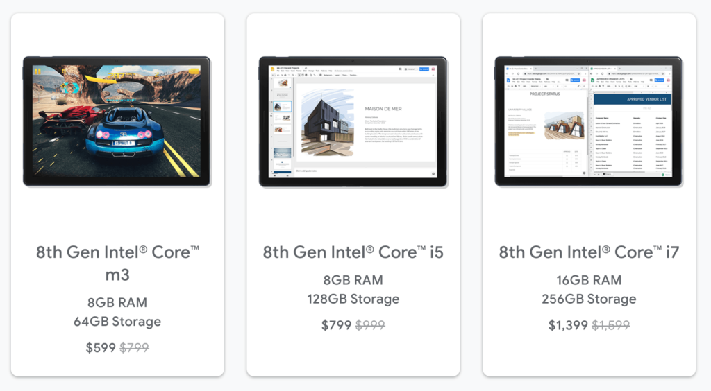

<iframe style="width:120px;height:240px;" align="right" marginwidth="0" marginheight="0" scrolling="no" frameborder="0" src="//ws-na.amazon-adsystem.com/widgets/q?ServiceVersion=20070822&amp;OneJS=1&amp;Operation=GetAdHtml&amp;MarketPlace=US&amp;source=ac&amp;ref=qf_sp_asin_til&amp;ad_type=product_link&amp;tracking_id=aboutchromebo-20&amp;marketplace=amazon&amp;region=US&amp;placement=B07JWB7QB2&amp;asins=B07JWB7QB2&amp;linkId=5a99889e543b6dd4274c7fbcfb3503d9&amp;show_border=true&amp;link_opens_in_new_window=true&amp;price_color=333333&amp;title_color=0066c0&amp;bg_color=ffffff"></iframe>

When the Pixel Slate landed in reviewers hands last year, it was almost universally panned. About the only positive reviews out there [were mine](https://www.aboutchromebooks.com/reviews/google-pixel-slate-review/) and [Jerry Hildebrand's over at Android Central](https://www.androidcentral.com/google-pixel-slate-review).

There were valid reasons for the general negativity, ranging from the relatively high price, poor performance on lower-end models and [animation lag in tablet mode](https://www.aboutchromebooks.com/news/pixel-slate-celeron-review-video/).

I think most reviewers also had unrealistic expectations as well, comparing the Pixel Slate to the Apple iPad: Even though the form factors are the same, the Slate is based around a desktop browser while the iPad is a mobile-centric operating system.

Regardless, one of the issues is at least partially resolved since [all available models of the Pixel Slate are now $200 less expensive](https://store.google.com/config/pixel_slate).

How long will that discount last? I don't know but I wouldn't be surprised if it's around for a while. Or if it does disappear quickly, I'd expect to see it again every few weeks or so.

But a discounted price alone doesn't absolve the Pixel Slate of all its initial faults. However, the Pixel Slate of today isn't the same one that launched in October. There have been four full OS updates to the Stable Channel since then and there are currently newer versions in the works that I've been following.

[Chrome OS 75 actually addresses what turned off many would-be buyers](https://www.aboutchromebooks.com/news/chrome-os-75-pixel-slate-tablet-mode-animations-buttery-smooth-overview-lag/) who planned to use their Pixel Slate solely as a tablet instead of a Chromebook with a detachable keyboard: The animation lag. It's still not perfect but it's unarguably much improved.

https://youtu.be/4f6j0l9V5\_o

Then there's the relatively small 12.5-inch screen size for the Pixel Slate. I've read numerous comments around the web from folks who felt it's just not enough of a workspace. No, the discounted Slate doesn't have a bigger screen but we know that [virtual workspaces are coming to all Chrome OS devices](https://www.aboutchromebooks.com/news/heres-a-video-look-at-the-latest-virtual-desktop-spaces-for-chromebooks/), including the Pixel Slate, making it easier to manage apps across up to four desktops. It might be a mental thing, but I know I'll feel less "cramped" on my Slate, once this feature arrives.

When it comes to gaming on the Slate, you're generally relegated to Android titles or games in Linux. [The Pixel Slate can now take advantage of GPU acceleration in Linux](https://www.aboutchromebooks.com/news/video-pixel-slate-portal-steam-with-gpu-acceleration-chrome-os-76-chromebook/), making games go from totally unplayable to actually possible now.

https://youtu.be/0uEjo-jzPHg

Of course, [Google's Stadia game streaming service is expected this year, turning the Slate into a 1080p gaming rig](https://www.aboutchromebooks.com/news/google-stadia-turns-every-chromebook-into-a-pc-gaming-rig/). We'll have to see how much it costs, of course, and more details are expected in a few weeks at the E3 gaming show.

And while other features that have debuted since the Pixel Slate launched aren't specific to this device, they make the Slate far more useful. For example:

- [Audio playback support in Linux](https://www.aboutchromebooks.com/news/audio-playback-for-chromebooks-arrives-in-latest-chrome-os-74-dev-channel-release/)
- [Backup/restore of Linux containers](https://www.aboutchromebooks.com/news/chrome-os-74-dev-channel-how-to-backup-restore-linux-container-crostini/)
- [Native PDF annotation support](https://www.aboutchromebooks.com/news/chrome-os-73-dev-channel-adds-native-pdf-annotation-support/) that works with (or without) the Pixelbook Pen)
- [Support for Android movies and music downloads to an SD card](https://www.aboutchromebooks.com/news/chrome-os-72-how-to-download-android-movies-music-to-sd-card-on-chromebook/), which can be done with a USB-C card reader or hub on the Slate.
- [Mounting of Google Drive files in Linux](https://www.aboutchromebooks.com/news/chrome-os-73-dev-channel-adds-google-drive-play-files-mount-in-linux-usb-device-management-and-crostini-backup-flag/)

Simply put, today's Pixel Slate isn't the same as the device that debuted last year. Sure the hardware is the same, but the software experience and performance is much improved. And it's only going to get better.
