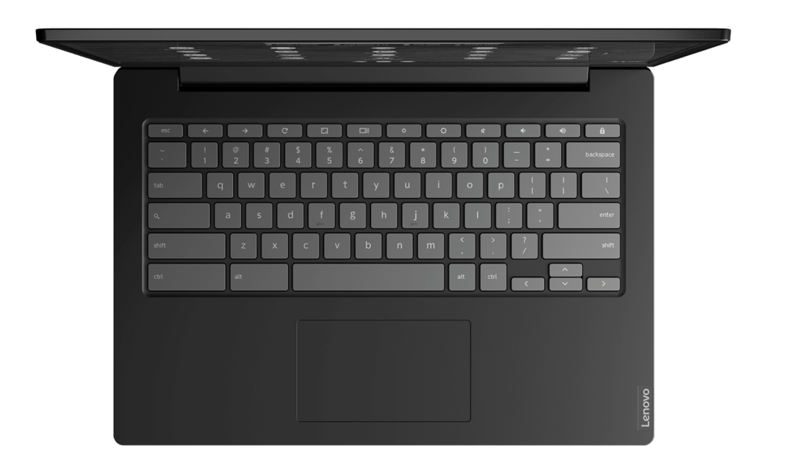

As more people are working or taking classes from home, it seems that the Chromebook market wasn't prepared for a big uptick in device demand. I've seen supply shortages across all brands and retailers based on what is likely limited inventory of Chromebooks. I've even drafted a few posts in the past week to point out some good deals only to find that in less than an hour, the devices were sold out!

So I was surprised to see the [Lenovo Chromebook S340 available for next-day shipping as of now](https://www.lenovo.com/us/en/laptops/lenovo/student-chromebooks/Lenovo-Chromebook-S340-14/p/88LGCS31289). Even better, while it's either available or can be shipped in around two weeks from some retailers, the direct Lenovo price of $249.99 is currently the best.

[Best Buy, for example, says it can ship a similar model but with 1080p display for delivery on May 18 for $299.99](https://www.bestbuy.com/site/lenovo-s340-14-touch-14-touch-screen-chromebook-intel-celeron-4gb-memory-32gb-emmc-flash-memory-onyx-black/6402114.p?skuId=6402114&ref=212&loc=1&ref=212&loc=1&ds_rl=1260576&gclid=CjwKCAjw4pT1BRBUEiwAm5QuR7qk6E01WEDAdCeugP1nFSoKIiEiJp4tlIeDuHBdQUnmuofVDX1h5BoCAcUQAvD_BwE&gclsrc=aw.ds).

Granted, this is an entry-level 720p device that's aimed for basic browsing but it should easily handle schoolwork for most kids, save perhaps for some high school programs. [Lenovo debuted the Chromebook S340 alongside the similar but smaller Chromebook C340 in August](https://www.aboutchromebooks.com/news/lenovo-chromebook-c340-s340-release-date-specs-pricing/).

For $250 then, this won't break any speed records. However, it won't bust your budget either.

Here's a rundown of the S340 specs:

<table><tbody><tr><td>CPU</td><td>Intel Celeron N4000, dual core</td></tr><tr><td>GPU</td><td>Intel UHD Graphics 600</td></tr><tr><td>Display</td><td>14-inch IPS panel, 1366 x 768 resolution, anti-glare, 220 nits of brightness</td></tr><tr><td>Memory</td><td>4 GB, LPDDR4</td></tr><tr><td>Storage</td><td>32 GB (eMMC), microSD card slot for expansion</td></tr><tr><td>Connectivity</td><td>802.11ac (2x2) WiFi, Bluetooth 4.2</td></tr><tr><td>Input</td><td>Keyboard (not backlit), multi-touch trackpad, 720p webcam</td></tr><tr><td>Ports</td><td>2 USB Type-C, 2 USB Type-A, combo headphone jack</td></tr><tr><td>Battery</td><td>42Wh capacity, up to 10 hours claimed runtime</td></tr><tr><td>Weight</td><td>3.09 pounds</td></tr><tr><td>Software</td><td>Chrome OS automatic updates through June 2026</td></tr></tbody></table>

Again, this is for just getting work done in a Chrome browser and maybe a few Android apps that don't rely heavily on a touchscreen for any software gaps; perfect for a secondary device or a student.

