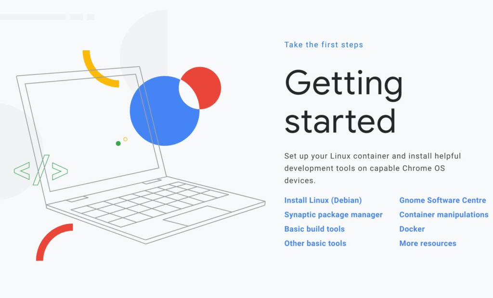
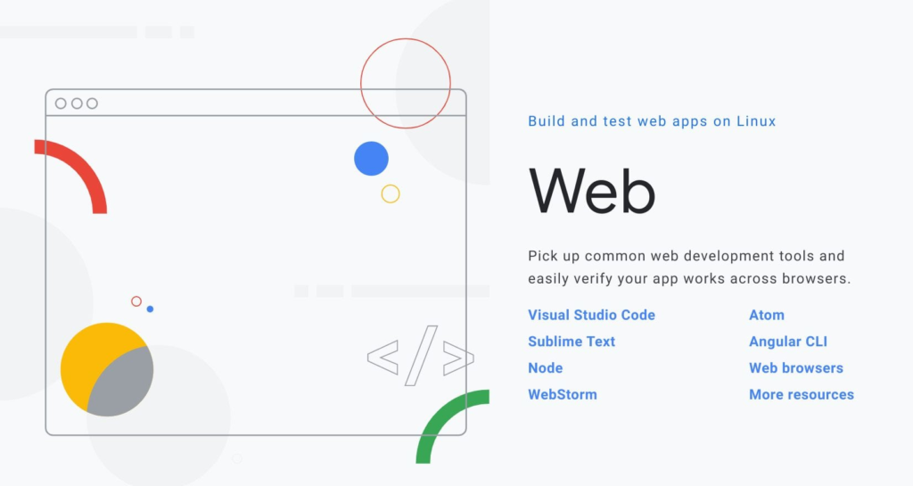

It's clear that Google is attempting to make Chromebooks a "first class citizen" when it comes to app and web development. [Android Studio support for app debugging is improving](https://www.aboutchromebooks.com/news/chrome-os-81-to-bridge-the-android-container-and-android-studio-for-easier-sideloads-on-chromebooks/), Linux containers have been available for a while now and Chrome's Developer Tools are among the best for web devs.

Putting all of the pieces in place to actually code with a Chromebook can be a daunting task though, especially if you're [working through a Computer Science degree program on a Chromebook](https://www.aboutchromebooks.com/news/can-you-learn-to-code-in-a-college-computer-science-program-with-a-chromebook/).

Enter the [Chrome OS Developer Toolbox](https://chromeos-cookbooks.firebaseapp.com/), which is full of setup instructions and code snippets to make the process easier.

The site is broken down into four categories: Setup, Android, Web and Games. Even if you already have a Chromebook with your development tools of choice, I'd recommend you start with the [Setup section](https://chromeos-cookbooks.firebaseapp.com/setup.html), or at least browse it.

Chrome OS Developer Toolbox

Aside from the basic Linux container setup process, it spotlights compatible tools and even the installation process for Linux distros other than Debian, which is the default. And for those interested in Docker containers, there's a short bit on that as well.

The [Android section](https://chromeos-cookbooks.firebaseapp.com/android.html) covers the basics of Android Studio installation and configuration if you plan to build Android apps. Included is a script to automatically connect to a tethered Android device for testing, although [Chrome OS 81 should have that feature built in](https://www.aboutchromebooks.com/news/chrome-os-81-to-bridge-the-android-container-and-android-studio-for-easier-sideloads-on-chromebooks/).

Setting up IntelliJ IDEA is also covered here, as is [Flutter](https://flutter.dev/) for Android Studio and Visual Code. I've been tinkering with Flutter (and Dart) in the latter on a Chromebook and I'm finding it very appealing; with a single codebase you can build mobile apps for Android and iOS.

Chrome OS Developer Toolbox Web

The [Web section](https://chromeos-cookbooks.firebaseapp.com/web.html) covers additional installations and configurations, but specifically for web development. Then again, you can use some of these dev tools for more than web sites or web apps, so it's worth the read. And most importantly is the reminder to test web development efforts across multiple browsers, not just on Chrome.

Lastly, the [Games](https://chromeos-cookbooks.firebaseapp.com/game.html) bit covers installation and first tutorials for game engines such as Unity and Unreal, as well as the open source Cocos2d-x game framework.

Portal on the Pixel Slate

Note that the instructions for setup explain how to enable GPU hardware acceleration from the command line; that shouldn't be needed any longer as nearly all Chromebooks have this enabled by default.

Overall, I'm impressed with this mini-site targeting developers who use, or could use, Chromebooks. More of this, please, Google!
