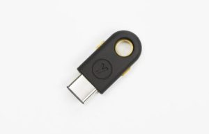

A big story making the rounds over the past few days is how the [power button of Google's Pixelbook works as a two-factor authentication (2FA) key](https://medium.com/@lukwam/pixelbook-power-button-as-utf-key-c55a26378bb1). From a technology perspective, this is admittedly interesting. Most hardware-based 2FA devices are just that: Separate devices, typically in the form of a USB key. I didn't cover the story because I had a concerning question, but we'll get to that in a minute.

When I worked for Google, I was issued a 2FA key. Whenever logging in to more secure internal sites and such, I'd have to pull the USB key (made by [Yubikey](https://www.yubico.com/products/yubikey-hardware/)) out, insert it into an open USB port on my computing device, and tap the gold part of the key for authentication. The key was registered to me, so it would only work when I was trying to log in to a site or app that required it. Put another way, nobody else could log in as me with my key unless they knew my password as well. I always kept the key attached to my Google badge instead of keeping it inserted into my computer.

With just two USB-C ports, the Pixelbook is a great candidate for some alternative to a USB key like I used. So, Google decided to use the hardware button. Clever, but...

Here's the thing. [Two-factor authentication requires two out of these three things](https://en.wikipedia.org/wiki/Multi-factor_authentication): Something you know (like a password), something you have (a USB key, perhaps) and/or something you are, such as a registered Bluetooth phone or a valid fingerprint. These are all separate things to make it harder for someone who shouldn't have access to a site or app to get that access.

I reached out to [Lukas Karlsson](https://medium.com/@lukwam?source=post_header_lockup), who was the first to write about the Pixelbook's power button functionality, mainly because I didn't see the two-factor separation offered by enabling the U2F feature.

After all, someone who knows your password and could get on your Pixelbook has two of the three authentication pieces because the second is built-in to the Pixelbook; namely the power button. To me, this is like having your personal PIN code printed on your ATM card.

When I asked Karlsson if the Pixelbook's integrated 2FA feature allows someone with my password to gain access, even with 2FA enabled, he responded (emphasis mine):

> Yes, your Pixelbook device itself becomes your second factor. **If someone is able to steal both your password and your Pixelbook, then they can gain access to your account**. If your Pixelbook goes missing, disable the U2F key immediately, just as you would if you lost your keychain and your Yubikey.

Based on my concern and Karlsson's confirmation, there's no way I'd enable 2FA with this particular method because it essentially **_eliminates_** the strength of a second authentication factor. Instead, I'd spend the money -- around $50 or less -- on an _external_ key to be the "something you have" part of 2FA. It's your call, of course, but using the Pixelbook hardware key seems more like 1.5 factor authentication (at best) to me.

_**Update**: The original article indicated that Karlsson works for Google, which is not the case_.
