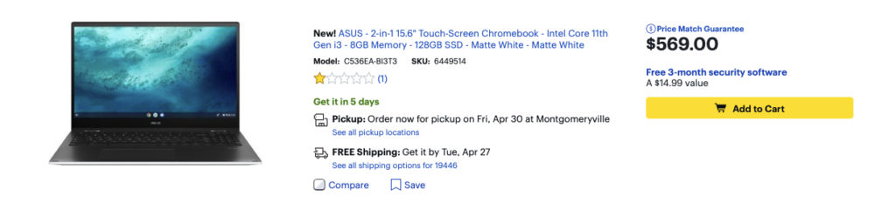
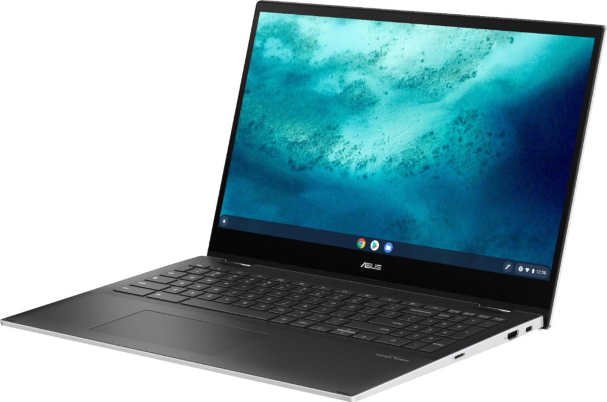

It doesn't appear in the Asus Store yet but folks in the US can now buy the ASUS Chromebook Flip C536, also known as the CX5. This 15.6-inch full HD convertible Chromebook was [announced in January](https://www.aboutchromebooks.com/news/asus-makes-the-biggest-ces-2021-splash-with-three-new-chromebooks-cm5-cx9-and-flip-c536/) and is the first Chromebook available with 11th-generation Intel Core processors. This particular configuration [spotted by Chrome Unboxed](https://chromeunboxed.com/the-worlds-first-tiger-lake-chromebook-is-now-available-for-569/) [has a Core i3 and costs $569 at Best Buy](https://www.bestbuy.com/site/asus-2-in-1-15-6-touch-screen-chromebook-intel-core-11th-gen-i3-8gb-memory-128gb-ssd-matte-white-matte-white/6449514.p?skuId=6449514).

Earlier today, this Chromebook was available for pickup in two days, so it appears there's either limited initial inventory and/or some demand for it.

There aren't many Chromebook options with 15.6-inch displays, as compared to smaller sizes. And there's no other option if you want the latest generation of Intel processors inside that Chromebook: Right now you'd have the buy the Asus Chromebook Flip C536.

As I get older and my eyes get worse, laptops like the ASUS Chromebook Flip C536 are becoming more appealing to me.

I do have a large external monitor I'm using more with my devices but a large display Chromebook that still gives me portability is ideal. And because [I use my Chromebooks for coding in my college CS classes](https://www.aboutchromebooks.com/news/can-you-learn-to-code-in-a-college-computer-science-program-with-a-chromebook/) (and have recently applied to a Masters in CS program), I need more computing power than the average user.

This _particular_ model doesn't quite cut it for me. It should meet or exceed the needs of most Chromebook users though with that [Intel Core i3-1115G4 CPU](https://ark.intel.com/content/www/us/en/ark/products/208652/intel-core-i3-1115g4-processor-6m-cache-up-to-4-10-ghz.html). No new Intel Iris Xe graphics are here though, for those wondering. Based on the back grilles, I do think there's a fan here.

You also get a generous 8 GB of what Best Buys says is LPDDR4x-4266 memory. I question that because the Intel product page for this Core i3 chipset says up to LPDDR4x-3733 is supported. Even if that's the case here, it's speedy.

Oh and the 128 GB of local storage should be quick too as it's listed as SSD and not eMMC. There aren't any other details on that but it's likely an M.2 NVMe drive inside.

That 15.6-inch display is fullHD, or 1920 x 1080, which is still more than adequate for a screen of this size.

Parts of the Best Buy page says this is not a touchscreen, which I think is completely inaccurate. One mention of it says it does have touch. I strongly suspect it **_does_** but I'd check before buying. I'd also look into the panel type used on the display since it's not specifically mentioned.

There is a backlit keyboard with full numeric keypad, plus a memory card slot, WiFi 6 support, Bluetooth (no version number provided), and an HD (I read that as 720p) webcam. I also see two USB Type-C ports, one USB Type-A, and a full-sized HDMI out port.

Again, this size of Chromebook is more intriguing to me than in the past. I need a bit more under the hood and have some open questions on the device, so I'm passing for now. If it looks good to you, [get your order in](https://www.bestbuy.com/site/asus-2-in-1-15-6-touch-screen-chromebook-intel-core-11th-gen-i3-8gb-memory-128gb-ssd-matte-white-matte-white/6449514.p?skuId=6449514) and let us know what you think when you get it. I have no idea how it feels to carry a 4.17 pound Chromebook!
