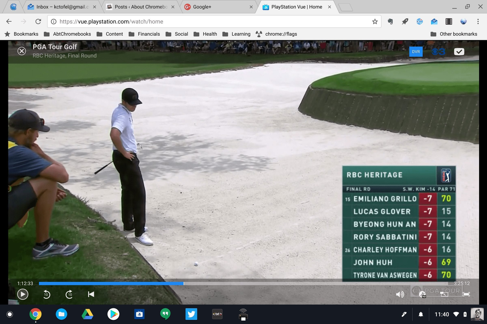

One of the first Android apps I installed on my Pixelbook was the Sony PS Vue app because that the service we use to watch television content in our home. Sony has long had viewing support in the browser but it only worked on Windows and MacOS. At least until now. Cord Cutters News on Monday reported that Sony now has a Flash-free viewing experience so you can [watch TV on a Chromebook right in your browser](https://www.cordcuttersnews.com/playstation-vue-adds-support-for-google-chromebooks/).

My trick of [using an extension to switch the user agent](https://aboutchromebooks.com/how-to/how-to-spoof-your-chromebook-user-agent-for-sites-that-dont-support-chrome-os/) to watch PS Vue content never worked in the past because that wasn't the issue. Instead, it had to do with Flash. Sony's latest server-side update uses HTML5 and supports Google Chromebooks. And it works! Here is screenshot of yesterday's PGA event, which I had DVR'd using Playstation Vue.

There was no need to change any settings or spoof a user-agent string. I just went to Sony's PS Vue site, logged in like I normally would and had access to both live and recorded TV on my Pixelbook browser.

I don't know that I'll uninstall the Android app because it's very touch-centric and works well on my Pixelbook. But for PS Vue subscribers who have older Chromebooks without Android app support, this is fantastic news.
