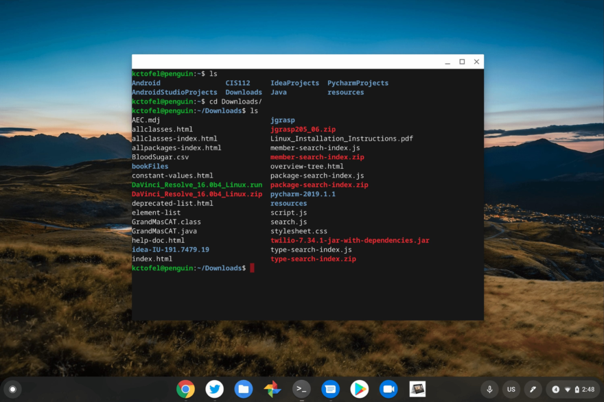
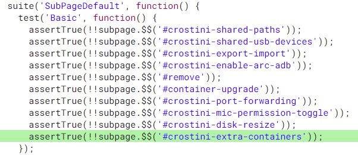

I've been running Linux containers on Chromebooks since the feature first appeared in beta about 3 years ago and it has changed the way I use my Chromebook. With this feature, I was able to [use a Chromebook for undergraduate Computer Science classes](https://www.aboutchromebooks.com/news/can-you-learn-to-code-in-a-college-computer-science-program-with-a-chromebook/), for example. And I now use it for [similar classes at the Masters level](https://www.aboutchromebooks.com/news/linux-on-chromebooks-just-might-get-me-through-a-masters-in-computer-science/).

While you could always [spawn multiple containers on a Chromebook](https://chromium.googlesource.com/chromiumos/docs/+/HEAD/containers_and_vms.md#How-many-containers-can-I-run), the process wasn't end-user friendly. Soon it will be, so you can run multiple Linux containers on Chromebooks.

[I first read about this on ZDNet](https://www.zdnet.com/article/chromebook-linux-comes-of-age/), absorbing the high-level details. I looked at the [Chromium code repository](https://chromium-review.googlesource.com/c/chromium/src/+/3193934) for additional information. And I see how Google is planning to implement this.

Essentially, you'll see new options in Settings for the Linux functionality. This is where you can currently manage the storage space of a Linux container, for example, or disable Linux completely.

Here are descriptive names for the current options, [along with the new one in](https://chromium-review.googlesource.com/c/chromium/src/+/3193934/39/chrome/test/data/webui/settings/chromeos/crostini_page_test.js#189) green:

By choosing the extra containers option, you'll be able to create or delete additional Linux containers, start or stop the VMs where the Linux instances are running, and more. As I read it, you should also be able to [assign different colors to different Linux containers](https://chromium-review.googlesource.com/c/chromium/src/+/3235951/7/chrome/browser/resources/settings/chromeos/crostini_page/crostini_extra_containers.js) as well. So you could have different containers for Debian, Arch, or some other Linux distributions.

This experimental, still-in-the-works feature will be disabled by default at first. To use it, you'll need to enable the `crostini-multi-container` flag in chrome://flags. Note that the current code says the flag is called "crotini". I assume that's a typo, so I've corrected it above.

I haven't yet seen the flag on my Chromebooks although most are currently running Chrome OS 94 Stable Channel. I'll be switching over to the [newest Chrome OS 97 Dev Channel](https://chromereleases.googleblog.com/2021/10/dev-channel-update-for-chrome-os_29.html) soon though. Once I do, this flag will be the first thing I look for.

Note that while the feature will allow you to run different Linux containers on Chromebooks simultaneously, it's not likely that this is the intended use case. I suspect this may be used for Steam gaming on Linux, although that's just a guess. Additionally, running multiple containers on a Chromebook is resource-intensive and will negatively affect performance.
