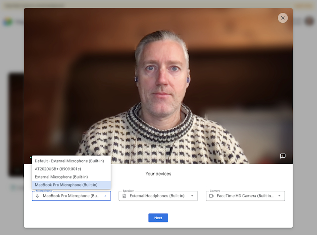
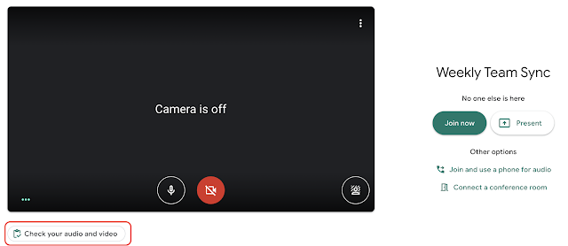

I've been using Google Meet much more on my Chromebook lately, given that Hangouts seems kaput for me. I suppose my transition away from Hangouts to both Meet and Chat are already in flight.

Folks that have a Google Workspace (formerly known as G Suite) account will see a new Meet feature on their Chromebook. It's [a "green room" to test and troubleshoot before joining a Meet video call](https://workspaceupdates.googleblog.com/2021/02/check-video-and-peripheral-device-quality-with-google-meet-self-check.html).

Announced today with the rollout already starting, this change consolidates audio and video device settings to a single location in Google Meet.

When you see the "Check your audio and video" button before joining a Meet call, click it to test and/or adjust your microphone, speakers and camera.

If you don't have a paid Google account, you won't get to enter the "green room"; at least not yet.

Typically, Workspace subscription accounts see new features like this first and then many of them filter down to the free Gmail accounts. Given that we're still in a work from home situation around the world, my hope is that the "green room" appears sooner rather than later for Gmail accounts.

Until then the rollout is specific to the following customers: Google Workspace Essentials, Business Starter, Business Standard, Business Plus, Enterprise Essentials, Enterprise Standard, and Enterprise Plus, as well as G Suite Basic, Business, Education, Enterprise for Education, and Nonprofits customers.

I'm betting that most consumer Chromebook users just have the free Gmail account with Google. But I'm wondering: do any of you have a G Suite / Workspace account so you can use a custom domain with your email?

If so, you're the "admin" of your account, can manage your Chromebook, and typically enable certain features. You don't have to with this one as it will just appear. Again, just curious!
